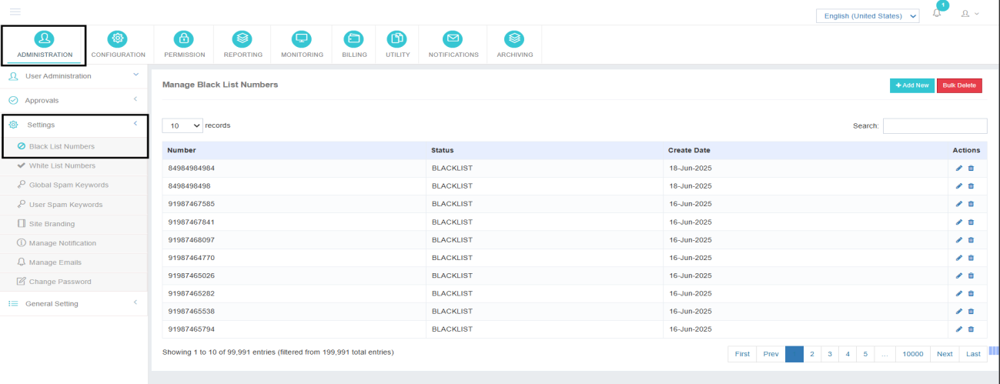
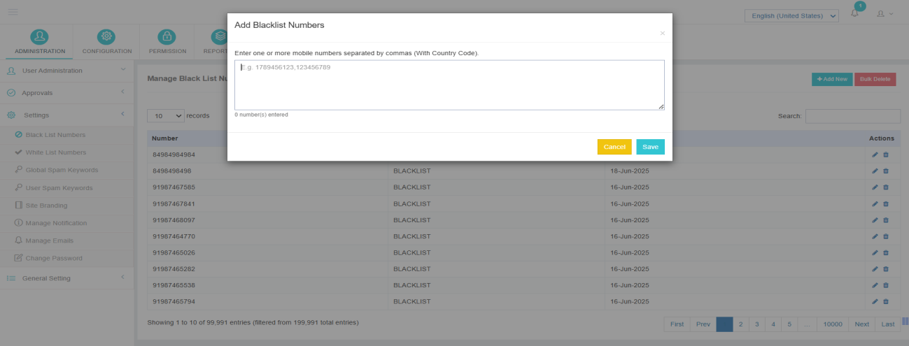
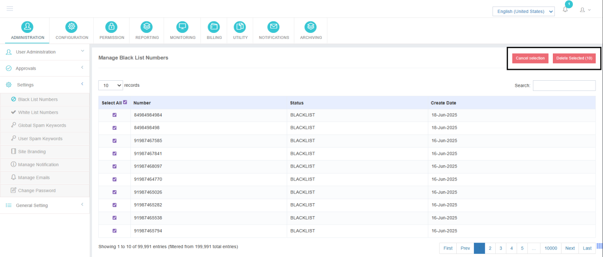

---
---

# Blacklist Numbers

The **Blacklist Numbers** feature allows administrators to define a list of mobile numbers that are blocked across the application. Once a number is added to the blacklist, **all outbound messages to that number are automatically rejected by the application**, and no user will be able to send messages to it.

## Purpose

This feature is used to prevent message delivery to restricted, invalid, non-compliant, or prohibited numbers in order to maintain regulatory compliance and control misuse.

---

## Adding Numbers to the Blacklist

1. Navigate to the **Blacklist Numbers** section in the admin panel.
2. Click on **Add New**.
3. Enter the mobile numbers in the input field.
    - Multiple numbers can be added at once by separating them with commas (`,`).
4. Ensure that **each mobile number includes the country code** (e.g., +91XXXXXXXXXX).
5. Save the changes to apply the blacklist entries across the application.

---

## Deleting Blacklisted Numbers

The application supports **bulk deletion**, allowing administrators to remove multiple blacklist entries in a single operation.

Administrators may also **delete selected entries individually** as required.

---

## Message Handling Behavior

!!! warning "Blocked Messages"
    - Any message sent to a blacklisted number will be **blocked at the application level**.
    - The message request will be **rejected immediately**, and it will not be forwarded to the vendor.

!!! tip
    Ensure that each mobile number includes the **country code** (e.g., +91XXXXXXXXXX) for correct functionality.
