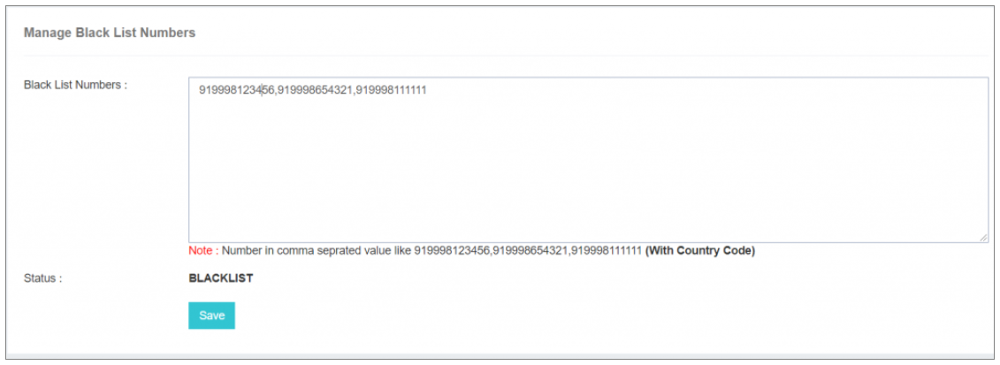

## 🚫 Blacklist Numbers

The **"Blacklist Numbers"** feature empowers users to maintain a **comprehensive databank of globally blacklisted numbers**. When a number is blacklisted, **no messages will be delivered** to these specified numbers—**regardless of the interface** used.

---

### **Usage Note**

To utilize this functionality, users simply need to **add mobile numbers to the blacklist**, ensuring inclusion of the **respective country code**.

This capability provides users with a **powerful tool** to manage **communication preferences** and **restrictions**, enhancing **control over message delivery** and ensuring that messages are not sent to designated blacklisted numbers.
