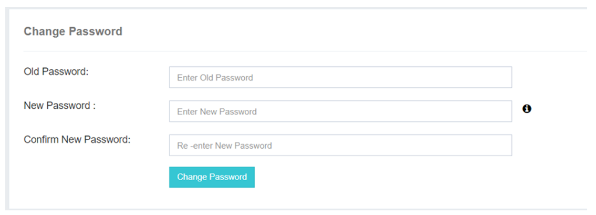

## 🔒 Change Password

The **Change Password** option in iTextPRO provides users with the flexibility to update their admin account password at their convenience. This feature allows for a personalized and secure password change experience.

---

---

### Change Password Process:

- **Initiating Change:**  
  Users can click on the **Change Password** option to begin updating their admin account password.

- **Prerequisites:**  
  The page lists prerequisites that must be fulfilled before proceeding, such as providing the current password as a security measure.

- **Current Password Requirement:**  
  Users must enter their current password to authenticate the change process. This step is mandatory to ensure the security of the admin account.

- **Additional Information:**  
  Users can refer to the **iTextPRO Password Policy** for detailed guidelines, accessible via the (i) icon. The policy outlines specific requirements to follow when creating or changing passwords.

---

This feature not only offers a secure and personalized password update process but also reinforces adherence to security protocols, maintaining the integrity and confidentiality of user accounts within the iTextPRO application.
