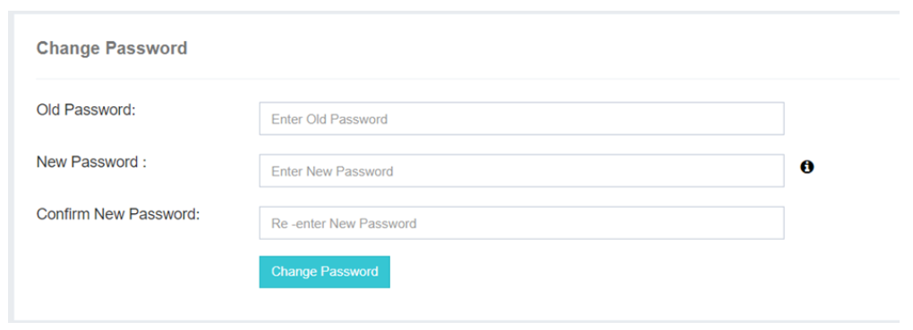

## 更改密碼

這個 **更改密碼** 選項在 iTextPRO 中為使用者提供了方便更新管理賬戶密碼的靈活性。 這個功能可以進行個性化和安全的密碼更改體驗.

---

---

### 更改密碼程序 :

- **啟動變革:** 
 使用者可以點選 **更改密碼** 選項開始更新其管理賬戶密碼。

- **先決條件:** 
 該頁列出了在進行之前必須滿足的先決條件,例如提供當前的密碼作為安全措施。

- **當前密碼要求 :** 
 使用者必須輸入當前的密碼,以認證更改過程。 這一步驟是強制性的,以確保管理員帳戶的安全。

- **補充資料:** 
 使用者可以參考 **iTextPRO 密碼政策** 詳細指南,可透過(一)圖示獲取。 該政策概述了在建立或更改密碼時應遵循的具體要求。

---

這一功能不僅提供了安全和個性化的密碼更新程式,而且還加強了對安全協議的遵守,維護了iTextPRO應用程式內使用者賬戶的完整性和保密性.
