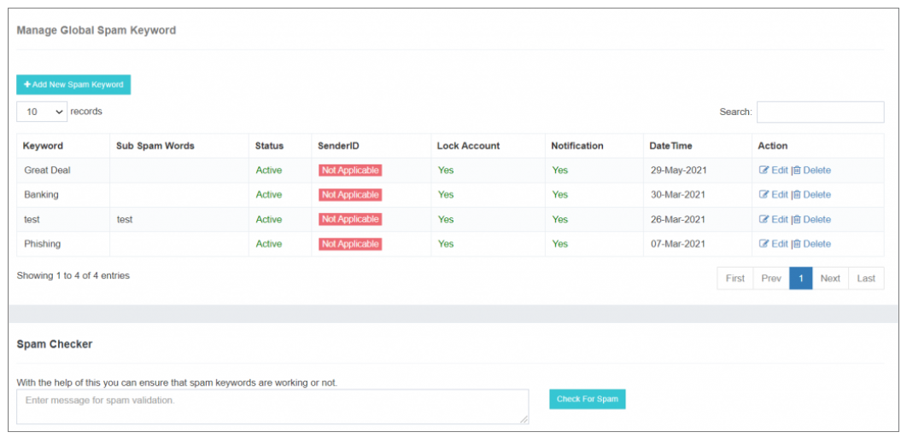
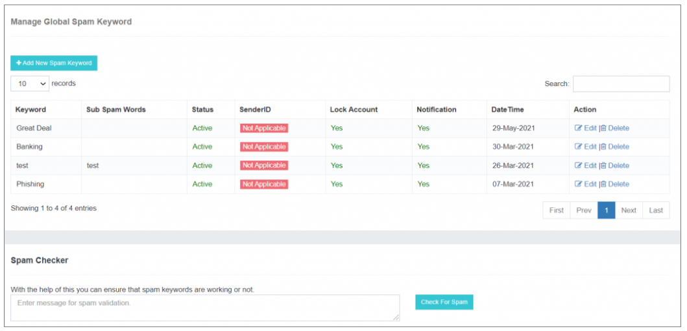
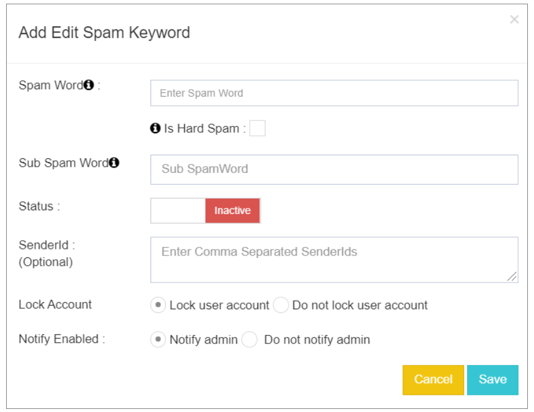
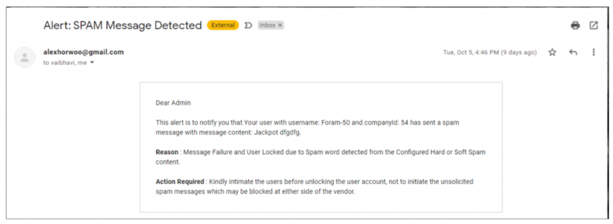

## Mots clés pourriels mondiaux

Dans l'application iTextPRO, il existe une **Moteur SPAM**, offrant aux utilisateurs la possibilité de **configurer un ensemble spécifique de mots-clés ou de phrases**. Ceci **ESPAGNE Le moteur fonctionne comme un filtre**, filtre efficacement les messages de spam.

Cette mesure proactive n'aide pas seulement **prévenir les sanctions imposées aux opérateurs** mais assure également **conformité aux lignes directrices réglementaires**. Fait important, il fournit un mécanisme pour **préserver l'intégrité de l'application** sans nécessiter une surveillance manuelle continue de la circulation.

---

### **Caractéristiques principales**

- **Activation par défaut :** 
 Les **Spam mondial** caractéristique est **activé par défaut** pour chaque utilisateur, **couche de protection inhérente**.

- **Dépassement de l'utilisateur :** 
 Utilisateurs considérés comme **entités de confiance** avoir la possibilité de **remplacer le paramètre par défaut** en désactivant le bouton de bascule associé à la fonction Spam Global.

Cette fonctionnalité équipe les utilisateurs d'une **outil robuste** maintenir le **intégrité de leur service de messagerie**, en veillant à ce que **réglementation industrielle** et éviter **sanctions éventuelles** associés à des messages de spam.

Les **flexibilité pour personnaliser les paramètres** permet aux utilisateurs de confiance d'adapter le comportement de l'application en fonction de leurs besoins spécifiques et de la base d'utilisateurs.

---

## Mots clés pour Spam

iTextPRO intègre a **robuste moteur SPAM**, offrant aux utilisateurs la possibilité de **configurer un ensemble de mots clés ou de phrases**. Ce moteur filtre les messages indésirables, fournissant un **approche proactive** éviter les sanctions des opérateurs et **conformité réglementaire**.

Il agit comme un **sauvegarde** pour l'application sans exiger une surveillance manuelle constante du trafic de messages.

---

### **Réglage par défaut du Spam global**

Par défaut, le **La fonctionnalité Spam Global est active** pour chaque utilisateur, **mesure de protection de base**.

---

### **Dépassement de l'utilisateur**

**Utilisateurs fiables** avoir la flexibilité pour **remplacer le paramètre par défaut** en désactivant le bouton de bascule associé à la fonction Spam Global.

---

### **Ajout/modification de mots-clés pourriels mondiaux**

Les utilisateurs peuvent ajouter de nouveaux mots-clés spam via un **interface conviviale**. Lors de la sélection **"Ajouter un nouveau mot-clé spam"** option, un popup apparaît incitant l'utilisateur à saisir les informations nécessaires.

---

### **Attributs de mots clés configurables pour Spam**

- **Pourriel :** 
 Représente tout message texte non désiré reçu sur un appareil mobile. Les mots clés sont **non sensible à la casse**.

- **Pourriel dur:** 
 Certains mots clés (par exemple, **Noms de marque**) peuvent avoir une **Politique de tolérance zéro**. 
 La case à cocher traite les messages avec ces mots-clés comme **100 % de SPAM**, conduisant à **rejet immédiat du message** et **notifications d'alerte** envoyé à l'administrateur du courrier recommandé.

- **Spam doux:** 
 Mots clés qui peuvent ne pas sembler spammy individuellement mais sont **dangereux en cas de combinaison** avec des mots sous-spam spécifiques. 
 Le système évalue **phrases liées**, traiter un message comme du spam si **les deux apparaissent ensemble**, peu importe l'ordre.

---

### **Actions configurables pour les pourriels détectés**

- **Compte de verrouillage & #160;:** 
 Définit une action à **verrouiller ou ignorer le compte utilisateur** lors de la détection d'un pourriel correspondant.

- **Ne pas verrouiller le compte utilisateur :** 
 Lorsque activé, iTextPRO **ne se verrouille pas** le compte utilisateur même si un mot de spam est détecté.

---

### **Options de notification**

- **Avertissement activé :** 
 Envoie un **Alerte email à l'administrateur** si une campagne utilisateur contenant un mot pourriel est détectée.

- **N'avisez pas l'administrateur :** 
 Désactive les notifications administratives pour les campagnes contenant des mots pourriels.

---

Cette **Système mondial de gestion des pourriels** améliore **contrôle et personnalisation**, permettant aux utilisateurs d'adapter les mécanismes de détection et de réponse de spam en fonction de leurs **exigences spécifiques et audience**.
