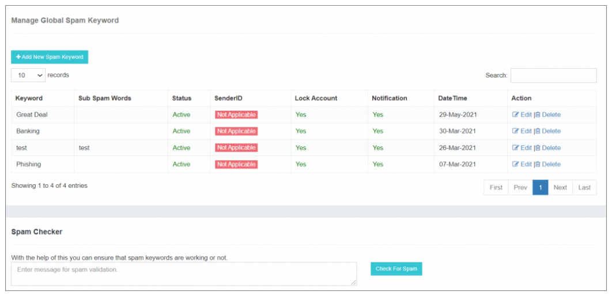
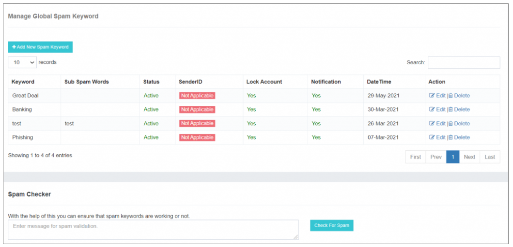
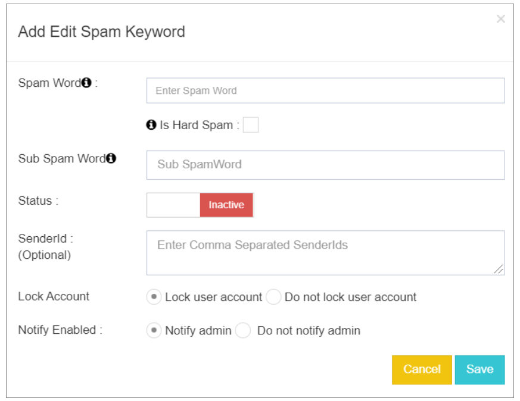
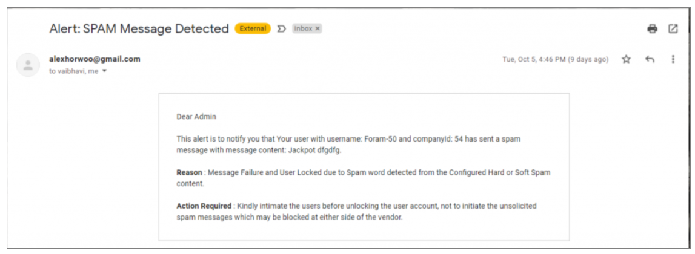

## 🛡️ Global Spam Keywords

Within the iTextPRO application, there exists an integrated **SPAM Engine**, offering users the ability to **configure a specific set of keywords or phrases**. This **SPAM Engine functions as a filter**, effectively screening out spam messages.

This proactive measure not only helps **prevent penalties from operators** but also ensures **compliance with regulatory guidelines**. Importantly, it provides a mechanism to **uphold application integrity** without requiring continuous manual monitoring of traffic.

---

### **Key Features**

- **Default Activation:**  
  The **Global Spam** feature is **activated by default** for every user, providing an **inherent layer of protection**.

- **User Override:**  
  Users deemed as **trusted entities** have the option to **override the default setting** by deactivating the toggle button associated with the Global Spam feature.

This feature equips users with a **robust tool** to maintain the **integrity of their messaging service**, ensuring adherence to **industry regulations** and avoiding **potential penalties** associated with spam messages.

The **flexibility to customize settings** allows trusted users to tailor the application's behavior according to their specific needs and user base.

---

## 🚫 Spam Keywords

iTextPRO incorporates a **robust in-built SPAM Engine**, offering users the ability to **configure a set of keywords or phrases**. This engine filters out unwanted messages, providing a **proactive approach** to avoid penalties from operators and ensuring **regulatory compliance**.

It acts as a **safeguard** for the application without requiring constant manual monitoring of message traffic.

---

### **Global Spam Default Setting**

By default, the **Global Spam feature is active** for every user, serving as a **baseline protective measure**.

---

### **User Override**

**Trusted users** have the flexibility to **override the default setting** by deactivating the toggle button associated with the Global Spam feature.

---

### **Adding/Editing Global Spam Keywords**

Users can add new spam keywords through a **user-friendly interface**. Upon selecting the **"Add new spam keyword"** option, a popup appears prompting the user to input necessary information.

---

### **Configurable Spam Keyword Attributes**

- **Spam Word:**  
  Represents any unwanted text message received on a mobile device. Keywords are **not case-sensitive**.

- **Hard Spam:**  
  Certain keywords (e.g., **brand names**) may have a **zero-tolerance policy**.  
  Ticking the checkbox treats messages with these keywords as **100% SPAM**, leading to **immediate message rejection** and **alert notifications** sent to the registered mail admin.

- **Soft Spam:**  
  Keywords that may not seem spammy individually but are **dangerous when combined** with specific sub-spam words.  
  The system evaluates **linked phrases**, treating a message as spam if **both appear together**, regardless of order.

---

### **Configurable Actions for Detected Spam**

- **Lock Account:**  
  Defines an action to **lock or ignore the user account** upon detection of a matching spam word.

- **Do Not Lock User Account:**  
  When enabled, iTextPRO **does not lock** the user account even if a spam word is detected.

---

### **Notification Options**

- **Notify Enabled:**  
  Sends an **email alert to the admin** if a user campaign containing a spam word is detected.

- **Do Not Notify Admin:**  
  Disables admin notifications for campaigns containing spam words.

---

This comprehensive **Global Spam Management system** enhances **control and customization**, allowing users to tailor spam detection and response mechanisms based on their **specific requirements and audience**.
