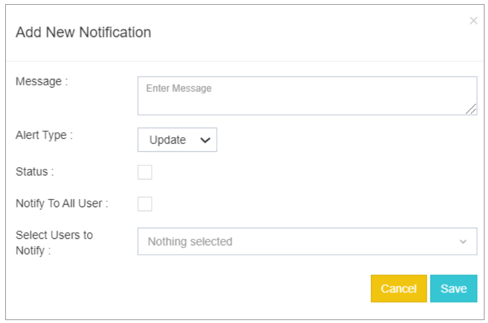
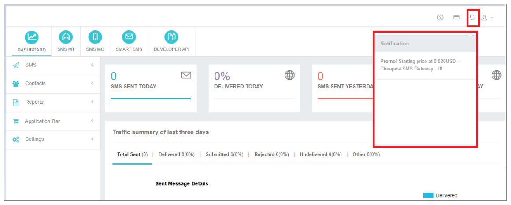

## Manage Notification

Notificaciones en **iTextPRO** permite que usted y su revendedor transmitan mensajes importantes directamente a sus usuarios. La plataforma proporciona un proceso directo para gestionar notificaciones:

---

### Crear una nueva notificación

Para crear una nueva notificación, haga clic en **"Añada nueva notificación"**, desencadenando un popup que le incita a introducir la información necesaria.

---

### Detalles de la notificación

- **Mensaje:** 
 Introduzca el mensaje que desea comunicar a sus usuarios.

- **Tipo de alerta:** 
 Seleccione el tipo de mensaje del desplegable, incluyendo opciones como **Actualización / Alerta / Información / Promo**.

- **Situación:** 
 Activar la notificación marcando la casilla de verificación si desea que esté activa.

- **Notificar a todos los usuarios:** 
 Mostrar la notificación en todas las cuentas de usuario marcando la casilla de verificación.

- **Seleccione Usuarios para Notificar:** 
 Elija usuarios específicos a los que desea enviar la notificación en sus cuentas.

- **Notificaciones de ahorro:** 
 Haga clic en **Guardar** botón para guardar y mostrar las notificaciones en las cuentas de usuario seleccionadas.

---

Este proceso simplificado garantiza una comunicación eficaz con los usuarios, lo que le permite transmitir actualizaciones, alertas, información o promociones sin problemas. Mediante la personalización de los datos de notificación y la selección de grupos de usuarios específicos, puede mejorar la experiencia de comunicación dentro de la plataforma iTextPRO.

---

### Notification Bar

El **Notification Bar** en iTextPRO sirve como centro centralizado para gestionar y mostrar notificaciones importantes. Los usuarios y administradores pueden mantenerse informados sobre actualizaciones cruciales, alertas y mensajes directamente dentro de la aplicación.

---

### Gestionar correos electrónicos

Esta característica mejora la comunicación permitiendo **Alertas de notificación por correo electrónico** para identificadores de correo electrónico seleccionados. Los usuarios pueden personalizar los ajustes de notificación para recibir alertas para diversos eventos realizados por la aplicación iTextPRO.

Por defecto, todas las notificaciones de correo electrónico se envían a la identificación de correo electrónico del Administrador o registrado.

---

### Características clave

- **Notification Bar:** 
 Proporciona una visión consolidada de mensajes importantes, actualizaciones y alertas directamente dentro de la aplicación iTextPRO.

- **Manage Emails:** 
 Permite a los usuarios configurar alertas de notificación por correo electrónico para interesados específicos. Esta característica garantiza que las personas clave reciban actualizaciones oportunas sobre diversos eventos realizados por la aplicación.

---

### Nota

Las notificaciones de correo electrónico por defecto se envían al ID de correo electrónico del administrador o registrado, asegurando que la información crítica llegue al destinatario principal.

---

Estas características contribuyen colectivamente a la difusión efectiva de la comunicación y la información dentro de iTextPRO, asegurando que los interesados sean notificados rápidamente de los acontecimientos y actualizaciones pertinentes.
