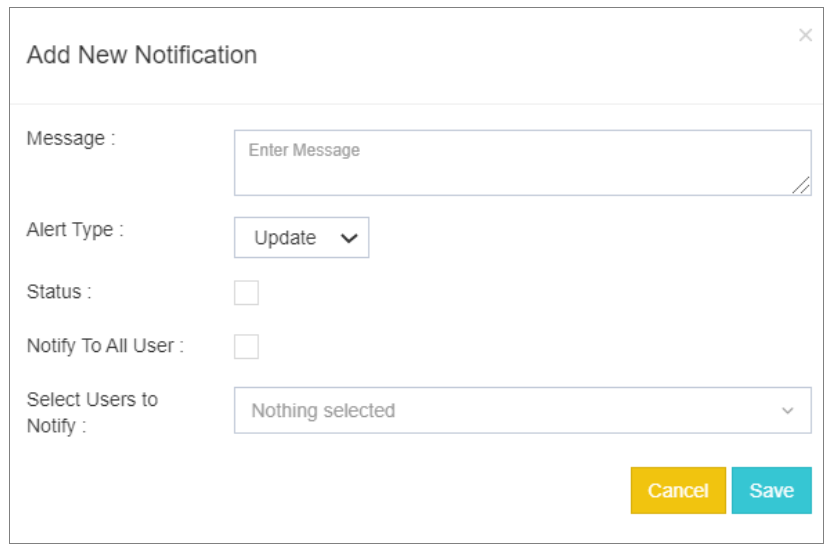
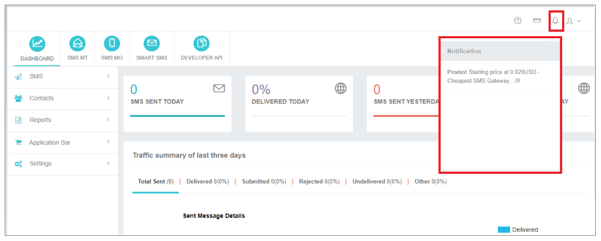

## 📢 Manage Notification

Notifications in **iTextPRO** allow you and your reseller to convey important messages directly to your users. The platform provides a straightforward process for managing notifications:

---

### Creating a New Notification

To create a new notification, click on **"Add new notification"**, triggering a popup that prompts you to input the necessary information.

---

### Notification Details

- **Message:**  
  Enter the message that you wish to communicate to your users.

- **Alert Type:**  
  Select the message type from the dropdown, including options like **Update / Alert / Info / Promo**.

- **Status:**  
  Activate the notification by ticking the checkbox if you want it to be active.

- **Notify to All Users:**  
  Display the notification in all user accounts by ticking the checkbox.

- **Select Users to Notify:**  
  Choose specific users to whom you want to send the notification in their accounts.

- **Saving Notifications:**  
  Click on the **Save** button to save and display the notifications in the selected user accounts.

---

This streamlined process ensures effective communication with users, allowing you to convey updates, alerts, information, or promotions seamlessly. By customizing notification details and targeting specific user groups, you can enhance the communication experience within the iTextPRO platform.

---

### Notification Bar

The **Notification Bar** in iTextPRO serves as a centralized hub for managing and displaying important notifications. Users and administrators can stay informed about crucial updates, alerts, and messages directly within the application.

---

### Manage Emails

This feature enhances communication by enabling **Email notification alerts** for selected stakeholder Email IDs. Users can customize the notification settings to receive alerts for various events performed by the iTextPRO application.

By default, all email notifications are sent to the Admin's or registered Email ID.

---

### Key Features

- **Notification Bar:**  
  Provides a consolidated view of important messages, updates, and alerts directly within the iTextPRO application.

- **Manage Emails:**  
  Allows users to configure Email notification alerts for specific stakeholders. This feature ensures that key individuals receive timely updates on various events performed by the application.

---

### Note

Default Email notifications are sent to the Admin's or registered Email ID, ensuring that critical information reaches the primary recipient.

---

These features collectively contribute to effective communication and information dissemination within iTextPRO, ensuring that stakeholders are promptly notified of relevant events and updates.
