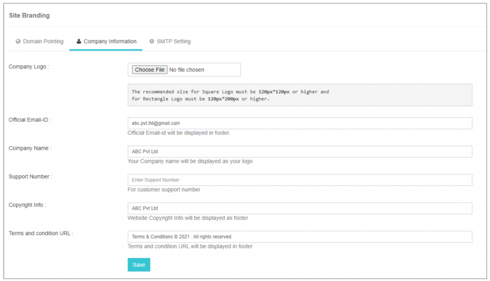
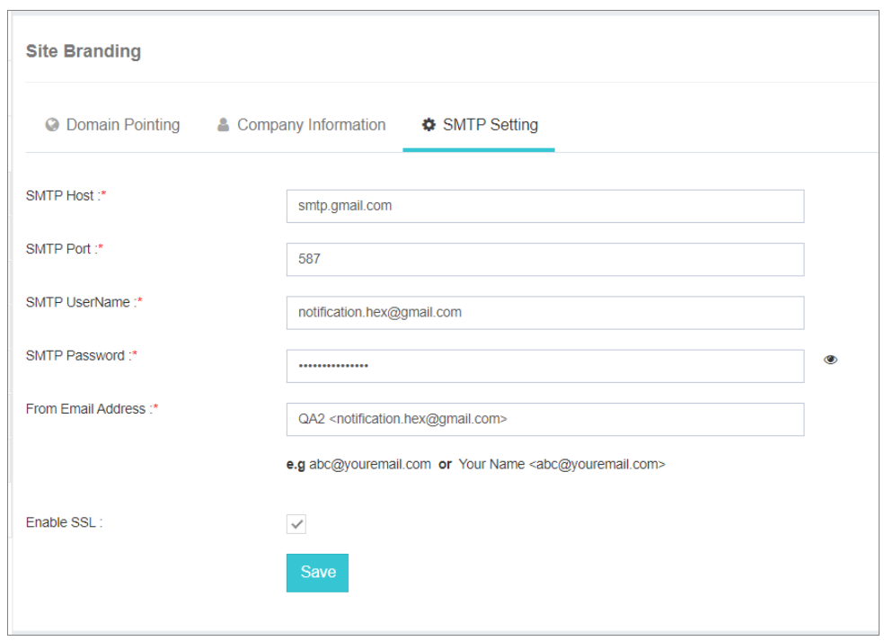

## 🖌️ Site Branding

Site Branding within **iTextPRO** empowers users and resellers to tailor the visual identity of their application by configuring crucial details, including **domain pointing**, **company information**, and **SMTP settings**. This feature enables the creation of a personalized and branded environment within the iTextPRO application.

---

### Site Branding Configuration

#### Step 1: Domain Pointing

The **Domain Pointing** tool simplifies the process of directing your domain or sub-domain to your server's IP address. This step establishes a seamless connection between your custom domain and the iTextPRO application.

You simply need to point the **“A record”** from any domain provider and configure the domain as shown below. *(Note: Please replace the current Google.com screenshot with a relevant image from your domain provider.)*

---

#### Step 2: Company Information

Configuration of **Company Information** involves dynamically setting values for various elements in the application based on your company details. Accuracy in inputting information in each field is crucial. 

If a company logo is not uploaded, the default company name will be displayed in the User Login panel of the application.

---

#### Step 3: SMTP Settings

**SMTP (Simple Mail Transfer Protocol)** settings play a vital role in sending notification alerts via email for various events to end-users. 

Ensure that SMTP settings are correctly configured and operational to facilitate effective communication through email notifications.

---

By seamlessly navigating through these three fundamental steps in Site Branding, users and resellers can elevate the visual appeal of their iTextPRO application, delivering a **customized** and **professional appearance**. Proper configuration guarantees a **cohesive and branded experience** for both administrators and end-users within the application.
