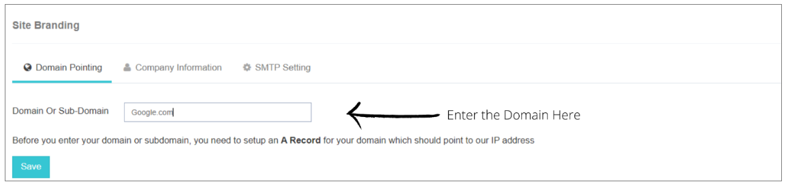
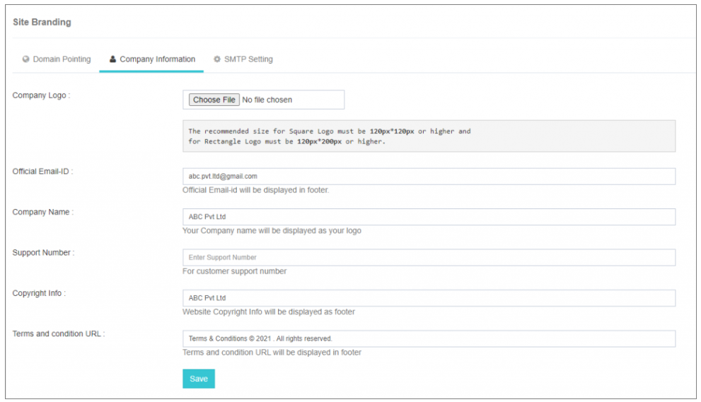
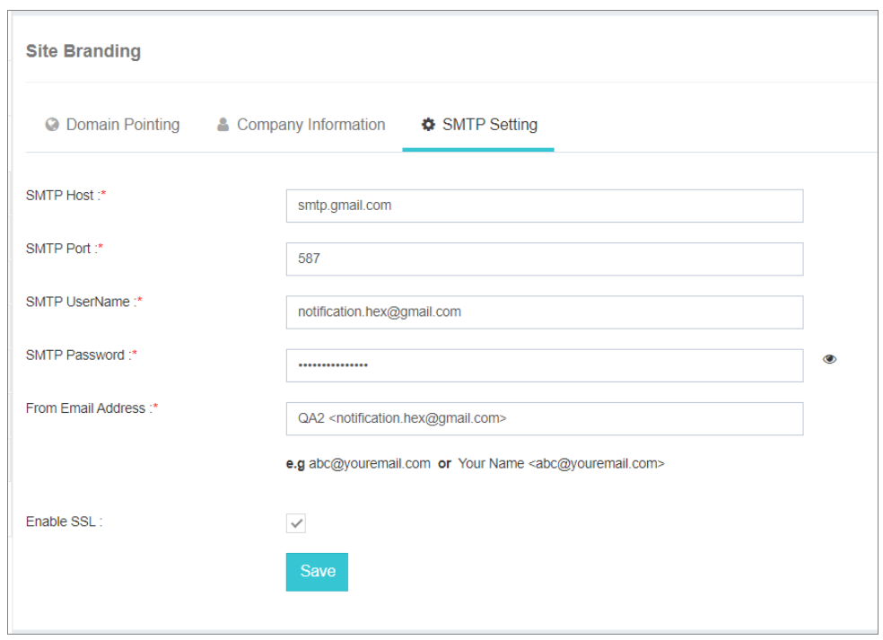

## 站點品牌

站點品牌內部 **電子文字PRO** 透過配置關鍵細節,包括: **域指標**, (中文(簡體) ). **企業資訊**,以及 **SMTP 設定**. 該功能可以在iTextPRO應用中建立個性化和品牌化的環境.

---

### 站點品牌配置

#### 步驟1:域指向

這個 **域指標** 工具簡化了引導域或子域到伺服器的IP地址的過程。 此步驟在您的自定義域和 iTextPRO 應用程式之間建立了無縫連線 。

你只需要指點一下 **“記錄”** 從任何域提供方獲取,並配置域名如下。 *(注:請將當前Google.com截圖替換為您域名提供者的相關影象. ).*

---

#### 步驟2:公司資訊

配置 **企業資訊** 涉及根據您的公司細節在應用程式中動態設定各種元素的值。 在每個領域準確輸入資訊至關重要。 

如果不上傳公司標誌,預設公司名稱將在應用程式的使用者登入面板上顯示.

---

#### 第3步: SMTP 設定

**SMTP(簡單郵件傳輸協議)** 設定在透過電子郵件向終端使用者傳送各種事件通知通知方面發揮著至關重要的作用。 

確保SMTP設定正確配置並執行,以透過電子郵件通知促進有效溝通.

---

使用者和轉售者透過無縫地瀏覽網站品牌的這三項基本步驟,可以提升其iTextPRO應用程式的視覺吸引力,從而提供 **定製** 財務報告和審定財務報表 **專業外出**適當的配置保障a **具有凝聚力和品牌的經驗** 適用於應用程式中的管理員和終端使用者。
