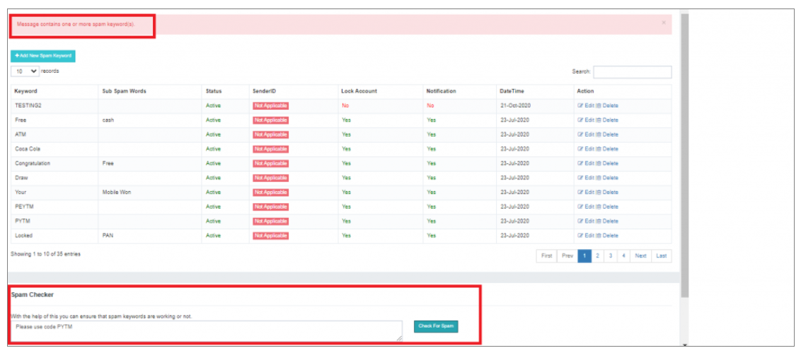

## 🧩 User Spam Keywords

In **iTextPRO**, users have the option to apply a **personalized spam check** on specific users by creating **User Wise Spam rules**, consisting of a custom set of keywords or phrases.

---

### **Workflow**

#### 🔍 User Search

To initiate the process, users can search for a specific user using the **search box**.  
The search box incorporates an **intelligent auto-fill feature** that streamlines the process by **suggesting matching records in alphabetical order**.

---

#### ➕ Adding New Spam Keyword

Upon identifying the user, click on **"Add new spam keyword"** to trigger a popup that prompts for the required information.  
This popup provides an **intuitive interface** for configuring **user-specific spam rules**.

---

#### 🧪 Spam Checker Tool

iTextPRO provides a **Spam Checker tool**, a convenient feature that allows users to **validate user-specific spam rules**.  
Users can **enter any text message** into the tool to check for **potential spam content**.

---

This **user-centric approach** to spam management empowers admins to **tailor spam rules** based on **specific user needs**.

The inclusion of the **Spam Checker** further enhances the experience by offering a **quick and effective way to validate and test** the configured spam rules.

