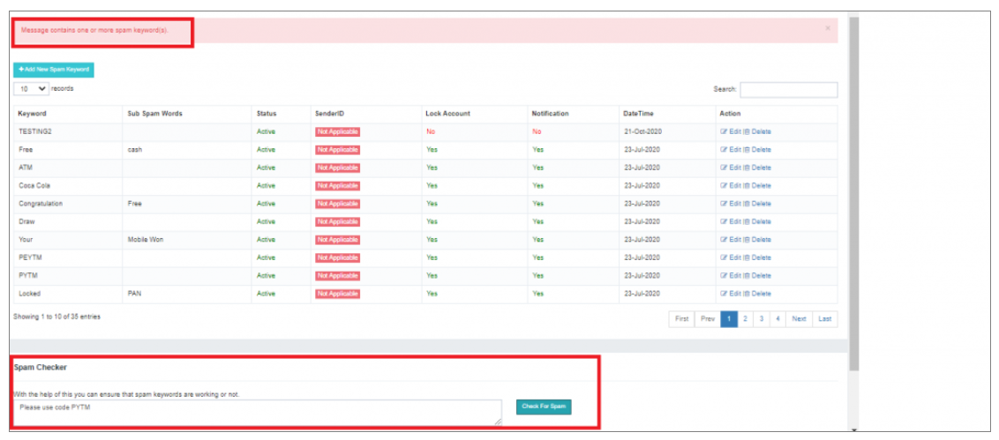

## 使用者垃圾郵件關鍵字

單位 **電子文字PRO**,使用者可選擇應用 **個性化垃圾郵件檢查** 透過建立特定使用者 **使用者智慧垃圾郵件規則**,由自定義的一組關鍵詞或短語組成。

---

### **工作流程**

#### 使用者搜尋

為了啟動這一程序,使用者可以使用 **搜尋框**。 。 。 。 
搜尋框包含 **智慧自動填充特性** 簡化程式 **建議按字母順序匹配記錄**。 。 。 。

---

#### 新增新垃圾郵件關鍵字

在識別使用者時,單擊 **"新增新的垃圾郵件關鍵字"** 以觸發彈出提示所需的資訊。 
這個彈出提供了 **直觀介面** 用於配置 **使用者專用垃圾郵件規則**。 。 。 。

---

#### 垃圾郵件檢查工具

iTextPRO 提供一個 **垃圾郵件檢查工具**,一個方便的功能,允許使用者 **驗證使用者特有的垃圾郵件規則**。 。 。 。 
使用者可以 **輸入任何簡訊** 輸入工具 **潛在的垃圾郵件內容**。 。 。 。

---

這個 **以使用者為中心的方法** 到垃圾郵件管理授權管理員 **定製垃圾郵件規則** 基於 **特定使用者需求**。 。 。 。

是否列入 **垃圾郵件檢查器** 進一步加強經驗,提供 **快速有效的驗證和測試方法** 配置的垃圾郵件規則。

