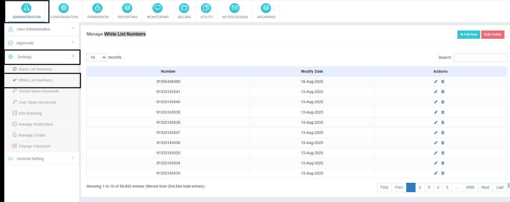
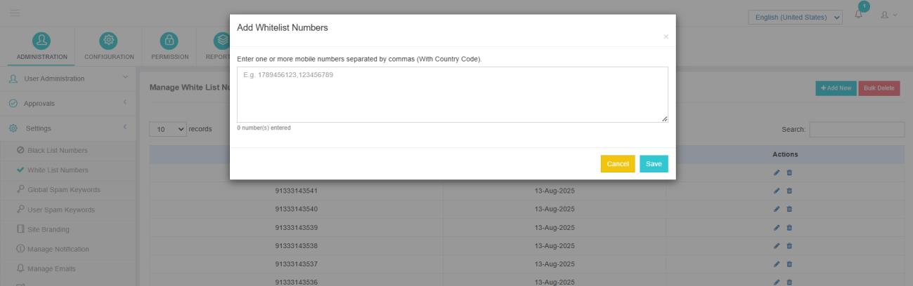
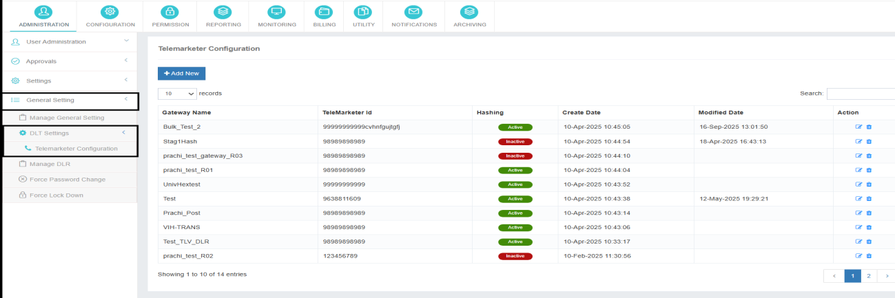

# White List Numbers

The **White List Numbers** feature allows administrators to define a list of globally whitelisted mobile numbers. When **DLR compensation** is enabled in the application, any message sent to a number included in the whitelist will always be submitted to the vendor and **will not be considered for DLR compensation**, regardless of delivery status.

## Purpose

This feature is useful for excluding specific numbers (such as test numbers, internal monitoring numbers, or priority contacts) from compensation logic while ensuring uninterrupted message delivery.

---

## Adding Numbers to the Whitelist

1. Navigate to the **White List Numbers** section from the admin panel.
2. Click on **Add New**.
3. Enter the mobile numbers in the input field.
4. Multiple numbers can be added at once by separating them with commas (`,`).
5. Ensure that **each mobile number includes the country code** (e.g., +91XXXXXXXXXX).
6. Save the changes to apply the whitelist entries globally.

---

## Deleting Whitelisted Numbers

The application supports **bulk deletion**, allowing administrators to remove multiple whitelist entries in a single action.

Administrators may also delete **selected entries individually** as required.

---

## Key Notes

!!! info "Important"
    - Whitelisted numbers are applied **globally across the application**.
    - Messages sent to these numbers are **excluded from DLR compensation calculations**.
    - Proper formatting with country codes is mandatory for correct functionality.
