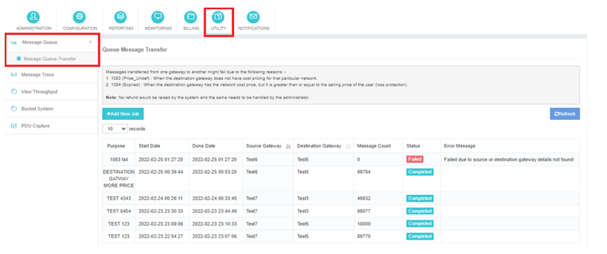
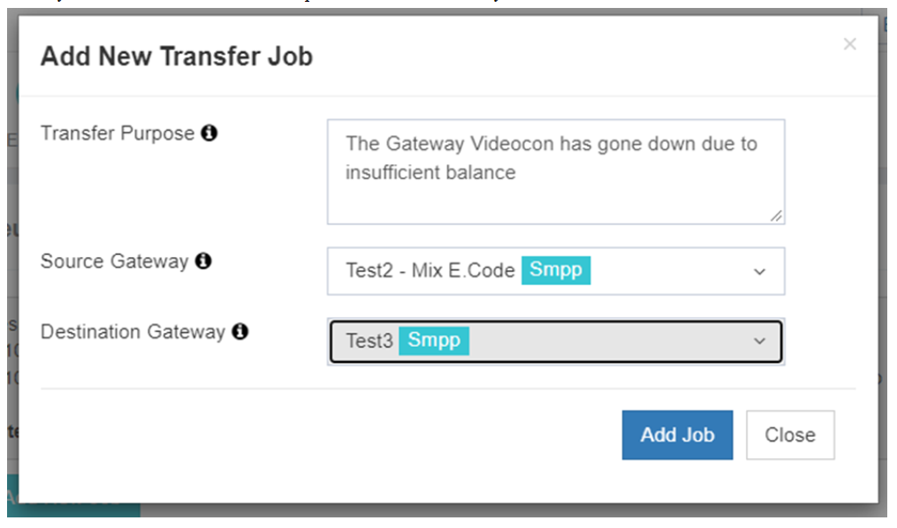

# Utility – Queue-to-Queue Transfer

The **Queue-to-Queue Transfer** feature in iTextPro enables seamless transfer of SMS traffic between gateways, ensuring efficient management of messaging operations.  
This functionality is particularly useful when your **primary gateway** experiences downtime or becomes non-functional. By using this option, you can **redirect traffic to an alternative gateway**, ensuring uninterrupted communication.

---

## Transfer Configuration

### 1. Transfer Purpose
Specify the purpose or reason for transferring the SMS traffic.  
This helps maintain **clear records** and provides context for the transfer.

### 2. Source Gateway
Select the **source gateway** from which messages will be transferred.  
iTextPro allows you to pick the **specific message queue** associated with this gateway.

### 3. Destination Gateway
Choose the **destination gateway** where messages should be delivered.  
This ensures that traffic is redirected to the correct operational endpoint.

### 4. Initiating the Transfer
Once the transfer parameters are set:
- Click the **"Add Job"** button.
- iTextPro will add the job to the transfer queue.
- The system will automatically transfer messages from the selected **source gateway** to the **destination gateway**.

This seamless process guarantees **continuity of SMS services** even in the event of gateway outages.

