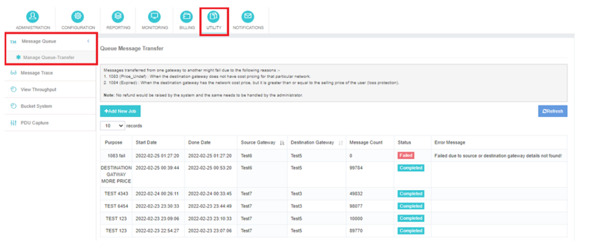
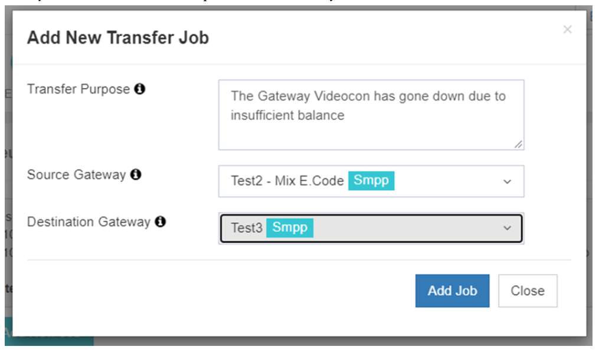

# - Queue-to-Queue Transfer

The The The The The The The The **Queue-to-Queue Transfer** iTextPro'daki özellik, mesajlaşma operasyonlarının verimli yönetimini sağlamak için ağ geçidi arasında SMS trafiğinin sorunsuz bir şekilde transfer edilmesini sağlar. 
Bu işlevsellik özellikle sizin için yararlıdır **birincil ağ geçidi** Deneyimler downtime veya işlevsel olmayan hale gelir. Bu seçeneği kullanarak, yapabilirsiniz **Alternatif bir ağ geçidine yönlendirme**Sürekli iletişim sağlamak.

---

## Transfer Yapı Kataloğu

### 1. Transfer Amaç
SMS trafiğini transfer etmek için amaç veya neden belirtin. 
Bu, korumaya yardımcı oluyor **Açık kayıtlar** ve transfer için bağlam sağlar.

### 2. Kaynak Gateway
Seç **kaynak ağ geçidi** Hangi mesajlar aktarılacaktır. 
iTextPro, seçmenize izin verir **Özel mesaj kuyruğu** Bu ağ geçidi ile ilişkili.

### 3. Hedef Kapısı
seçin the Select the **Hedef ağ geçidi** mesajlar teslim edilmelidir. 
Bu, trafiğin doğru operasyonel uç noktaya yönlendirilmesini sağlar.

### 4. Transferin başlatılması
Transfer parametreleri ayarlandığında:
- Click the Click the **"Add Job"** düğme.
- iTextPro, işi transfer kuyruğuna ekleyecek.
- Sistem otomatik olarak seçilen mesajlar transfer edecek **kaynak ağ geçidi** Ve **Hedef ağ geçidi**.

Bu sorunsuz süreç garanti eder **SMS hizmetlerinin sürekliliği** Ağ geçidinde bile.

