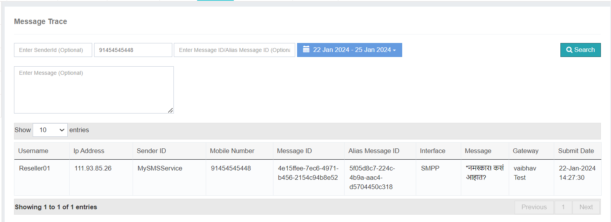

# Message Trace

The **Message Trace** option in iTextPro empowers you to **track and analyze message reports** with precision.  
By using the available filters, you can retrieve detailed information about specific messages, making it easier to investigate and resolve issues.

---

## Available Filters

### 1. Sender ID
Filter messages based on the **sender’s identification**.  
This helps you focus on messages sent from a particular sender.

### 2. Mobile Number
Search by a **specific mobile number** to retrieve detailed reports for messages associated with that recipient.

### 3. Message Content
Search using **keywords or exact content** to locate and analyze messages based on their text.

---

## Use Case
This feature is especially valuable when addressing concerns raised by **telecommunication providers**, such as:
- Do Not Disturb (**DND**) violations
- **Blacklisted numbers**
- **Potential spam** traffic

By tracing messages using these filters, you can quickly investigate and respond to any reported discrepancies.

---

## Important Note
The **Message Trace** option allows you to review message reports for **the last 3 days only**.  
Keep this limitation in mind when troubleshooting or resolving issues.

---

