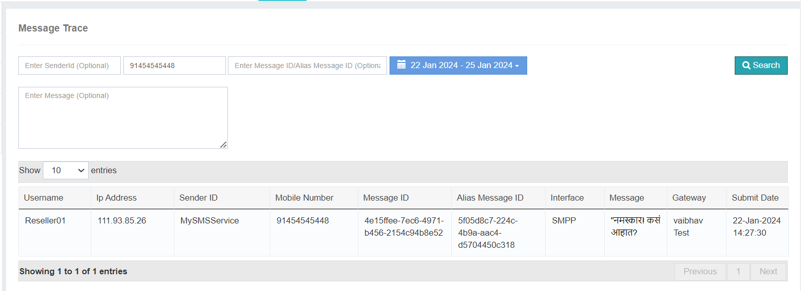

# 信件追踪

这个 **信件追踪** 选项在 iTextPro 中授权您 **跟踪和分析消息报告** 精确地说 
通过使用可用的过滤器,您可以检索关于特定消息的详细信息,从而更容易调查和解决问题.

---

## 可用过滤器

### 1. 发件人身份证
基于 **发送者身份证明**。 。 。 。 
这有助于您关注特定发送者发送的信息 。

### 2. 移动号码
搜索一个 **特定移动号码** 检索与该收件人有关的信息的详细报告。

### 3. 信息内容
使用 **关键词或确切内容** 查找和分析基于其文本的信息。

---

## 使用大小写
这一特点在解决特别报告员提出的关切时特别重要。 **电信供应商**,例如:
- 不干扰( N)**德国**() 违反
- **黑名单号码**
- **潜在的垃圾邮件** 交通

通过使用这些过滤器追踪消息,您可以快速调查并回应任何已报告的差异.

---

## 重要说明
这个 **信件追踪** 选项允许您审查信件报告 **仅过去3天**。 。 。 。 
在解决问题或解决问题时牢记这一限制。

---

