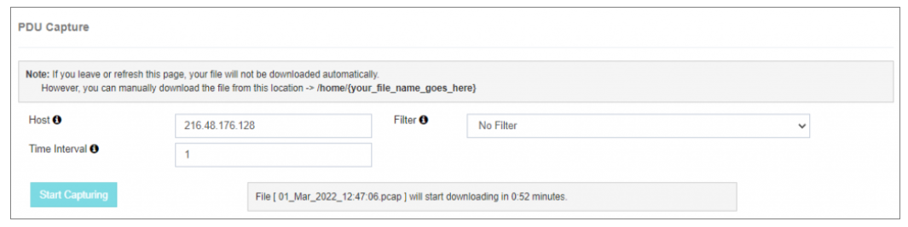

# Captura de PDU

El **Captura de PDU** opción es una herramienta poderosa para capturar **tráfico de mensajes en vivo** entrar o salir de la **Short Message Service Center (SMSC)**. 
Está diseñado específicamente para **solución de problemas en tiempo real** de la puerta de entrada o **Entidad externa de mensaje corto (ESME)** usuarios.

---

---

## Detalles de configuración

Para iniciar la captura de PDU, proporcione la siguiente información:

- **Host** 
 Especifique el **dirección host** o **servidor IP dirección** de la interfaz Ethernet conectada al servidor. 
 Esto identifica el camino de red para capturar PDUs.

- **Filtro** 
 Elija el deseado **filtro** para empezar a capturar PDUs en vivo. 
 Por ejemplo, seleccionando **port number 8585** capturará PDUs para ese puerto específico solamente. 
 Consulte la documentación para directrices detalladas sobre captura de PDU con **puerto 8585**.

- **Intervalo de tiempo** 
 Introduzca el intervalo de tiempo deseado (en minutos), con un **límite máximo de 90 minutos**. 
 Esto determina cuánto tiempo serán capturados los PDU en vivo.

---

## Nota
El **Captura de PDU** opción es una herramienta de diagnóstico invaluable **investigación de problemas en tiempo real**. 
Es especialmente útil para los usuarios que pueden no tener acceso a un equipo NOC o poseer habilidades avanzadas de solución de problemas de red. 

Garantizar que **detalles del host**, **filtros**, y **intervalos de tiempo** se configuran con precisión para obtener resultados óptimos.
