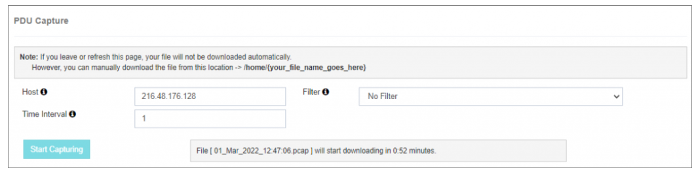

# PDU Capture

The **PDU Capture** option is a powerful tool for capturing **live message traffic** entering or exiting the **Short Message Service Center (SMSC)**.  
It is specifically designed for **real-time troubleshooting** of the gateway or **External Short Message Entity (ESME)** users.

---

---

## Configuration Details

To initiate the PDU capture, provide the following information:

- **Host**  
  Specify the **host address** or **server IP address** of the Ethernet interface connected to the server.  
  This identifies the network path for capturing PDUs.

- **Filter**  
  Choose the desired **filter** to start capturing live PDUs.  
  For example, selecting **port number 8585** will capture PDUs for that specific port only.  
  Refer to the documentation for detailed guidelines on PDU capture with **port 8585**.

- **Time Interval**  
  Enter the desired time interval (in minutes), with a **maximum limit of 90 minutes**.  
  This determines how long the live PDUs will be captured.

---

## Note
The **PDU Capture** option is an invaluable diagnostic tool for **real-time issue investigation**.  
It is especially useful for users who may not have access to a NOC team or possess advanced network troubleshooting skills.  

Ensure that **host details**, **filters**, and **time intervals** are configured accurately for optimal results.
