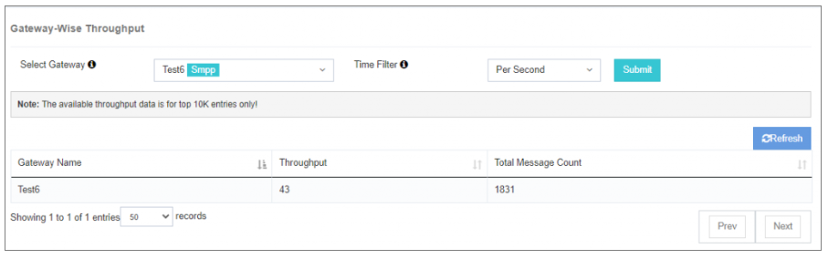

# Affichage du débit

Les **Affichage du débit** option fournit une ventilation détaillée de **Performance de la passerelle** en montrant des mesures de débit à différents intervalles de temps. 
Il aide à surveiller les taux de traitement des messages et à identifier les modèles de rendement.

---

## Cas d'utilisation
Cette fonctionnalité est inestimable pour:
- **Évaluation de l'efficacité de la passerelle**
- Suivi des tendances des débits **en temps réel** ou plus **périodes historiques**
- Identification **périodes de pointe**
- Trouver des possibilités pour **optimisation des ressources**

---

## Comment utiliser
1. **Sélectionnez le filtre à temps souhaité** pour afficher les données de débit correspondantes.
2. Revoir **représentation visuelle** des paramètres de débit.
3. Identifier les modèles, les tendances et les domaines d'optimisation potentiels.

En tirant parti des informations fournies, vous pouvez **décisions fondées sur des données** améliorer les performances et la surveillance des systèmes.

---

