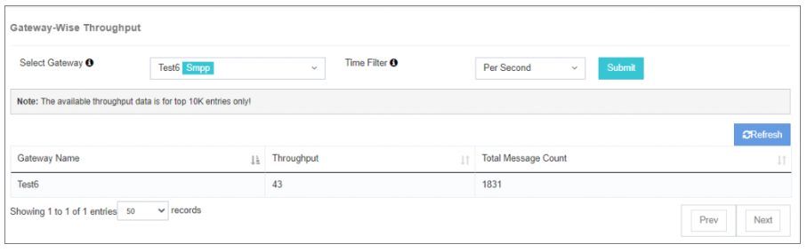

# View Throughput

The **View Throughput** option provides a detailed breakdown of **Gateway performance** by showing throughput metrics across different time intervals.  
It helps in monitoring message processing rates and identifying performance patterns.

---

## Use Case
This feature is invaluable for:
- **Assessing Gateway efficiency**
- Tracking throughput trends in **real-time** or over **historical periods**
- Identifying **peak load periods**
- Finding opportunities for **resource optimization**

---

## How to Use
1. **Select the desired time filter** to display corresponding throughput data.
2. Review the **visual representation** of throughput metrics.
3. Identify patterns, trends, and potential optimization areas.

By leveraging the insights provided, you can make **data-driven decisions** to improve performance and enhance system monitoring.

---

