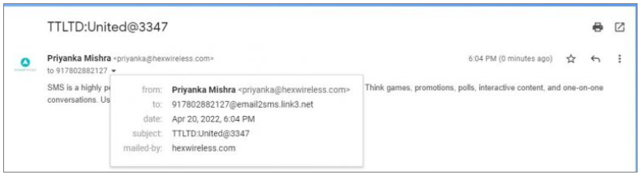

### E-mail 2 SMS: Communication email-to-SMS sans couture

Les **Courriel 2 SMS** fonctionnalité dans iTextPro permet aux utilisateurs de convertir des courriels en SMS, assurant des informations importantes atteignent les destinataires même sans connectivité Internet. 
Cette fonctionnalité est idéale pour les alertes critiques, les communications d'affaires et les campagnes de marketing.

---

#### Caractéristiques principales

- **Intégration du protocole SMTP** 
 Fonctionne de façon transparente avec le **Protocole de transfert de courrier simple** pour une transmission de messages fiable et normalisée.

- **Effortless Email-to-SMS Conversion** 
 Convertit automatiquement les messages électroniques standard en format SMS pour la livraison directe aux appareils mobiles.

- **Cas d'utilisation commerciale et commerciale** 
 Envoyer des SMS directement à partir de plates-formes d'email populaires (Outlook, Gmail, Hotmail, Yahoo, et plus) pour atteindre les clients rapidement.

- **Compatibilité étendue** 
 Prend en charge plusieurs fournisseurs de services de messagerie pour une flexibilité maximale.

---

#### Comment le courriel 2 SMS fonctionne

1. **Adresse électronique Format** 
 Envoyer le courriel à : 

2. **Domaine serveur SMTP** 
La communication suit le protocole SMTP pour assurer la fiabilité des messages.

3. **Format de courriel requis** 

4. **Exemple d'utilisation** 
Si l'adresse email enregistrée est **user@company.com** et vous souhaitez envoyer un SMS à **9876543210**, 
vous composeriez un email comme: 
- **Pour :** 9876543210@email2smsdomaine 
- **Depuis:** user@company.com 
- **Objet:** SenderID:LoginMot de passe 
- **Corps:** Votre contenu du message

---

Les **Courriel 2 SMS** fonctionnalité dans iTextPro comble l'écart entre l'email et la messagerie mobile, offrant un moyen rapide, fiable et efficace d'atteindre les clients sans compter uniquement sur la connectivité Internet.
