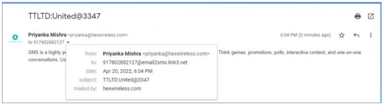

---

### Email 2 SMS: Seamless Email-to-SMS Communication

The **Email 2 SMS** feature in iTextPro allows users to convert emails into SMS messages, ensuring important information reaches recipients even without internet connectivity.  
This feature is ideal for critical alerts, business communications, and marketing campaigns.

---

#### Key Features

- **SMTP Protocol Integration**  
  Works seamlessly with the **Simple Mail Transfer Protocol** for reliable and standardized message delivery.

- **Effortless Email-to-SMS Conversion**  
  Automatically converts standard email messages into SMS format for direct delivery to mobile devices.

- **Business & Marketing Use Cases**  
  Send SMS directly from popular email platforms (Outlook, Gmail, Hotmail, Yahoo, and more) to reach customers quickly.

- **Wide Compatibility**  
  Supports multiple email service providers for maximum flexibility.

---

#### How Email 2 SMS Works

1. **Email Address Format**  
   Send the email to:  

2. **SMTP Server Domain**  
Communication follows the SMTP protocol to ensure message reliability.

3. **Required Email Format**  

4. **Usage Example**  
If the registered email address is **user@company.com** and you wish to send an SMS to **9876543210**,  
you would compose an email as:  
- **To:** 9876543210@email2smsdomain  
- **From:** user@company.com  
- **Subject:** SenderID:LoginPassword  
- **Body:** Your message content

---

The **Email 2 SMS** feature in iTextPro bridges the gap between email and mobile messaging, offering a fast, reliable, and efficient way to reach customers without relying solely on internet connectivity.
