# Pays

## Définition
Messages MO (**Mobile d'origine** messages) sont initiés par les utilisateurs de téléphone mobile et envoyés à des shortcodes dédiés ou des numéros de code longs en utilisant des mots-clés spécifiques. 
Ils permettent aux clients ou aux abonnés d'interagir directement avec les fournisseurs ou les applications.

---

## Processus

### Ouverture de l'utilisateur
Un client envoie un message texte avec un mot-clé spécifique à un shortcode dédié ou un code long.

**Exemple :** 
<span data-ph="0"></span> → <span data-ph="1"></span>

### Routage des messages
Le message est acheminé vers l'application ou le fournisseur lié à ce shortcode ou ce numéro.

---

## Points clés
- Permet une communication bidirectionnelle entre les utilisateurs et les fournisseurs.
- Utilise des mots-clés spécifiques pour déclencher les réponses.
- Fonctionne via des shortcodes dédiés ou des codes longs.

---

## Configuration des gestionnaires HTTP MO

### Aperçu général
Gestionnaires HTTP MO dans **iTextPro** recevoir les messages MO entrants des fournisseurs. 
Les structures de charge utile peuvent différer selon les fournisseurs.

### Étape 1: Ajouter un nouveau handler
1. Cliquez sur **Ajouter un nouveau manuel**.
2. Paramètres de charge utile de la carte dans l'interface utilisateur.

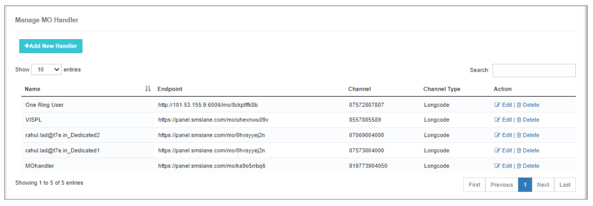

**Préalables:** 
Connaissance de base des API RESTful.

**Exemple (Vendeur: Airtel):**
```json
{
  "originatorAddress": "999563256",
  "destinationAddress": "8754321565",
  "messageContent": "BINGO 101",
  "CustomerId": "669912"
}
```

**Config iTextPro :**
- Méthode: <span data-ph="0"></span>
- Type de contenu & #160;: <span data-ph="0"></span>
- Clé d'origine : <span data-ph="0"></span>
- Clé de destination : <span data-ph="0"></span>
- Clé du message : <span data-ph="0"></span>

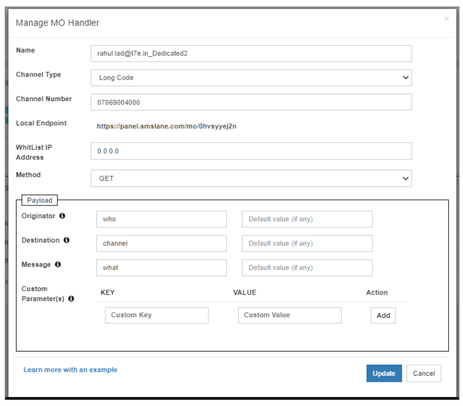

---

### Étape 2: Configurer les services MO pour le compte utilisateur
1. Connectez-vous à iTextPro → localisez le compte utilisateur.
2. Activer **MO Services** dans **Gestion des services**.
3. Définir le numéro de MO et le mot clé :
   - Date de fin
   - Sélectionnez Canal (numéro d'OM)
   - Mot-clé (ou <span data-ph="0"></span> pour tous)
   - État : actif
4. Cliquez sur **Ajouter**.

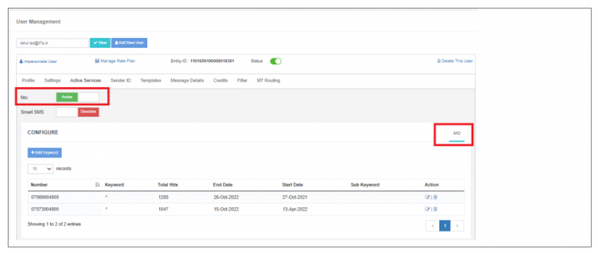 
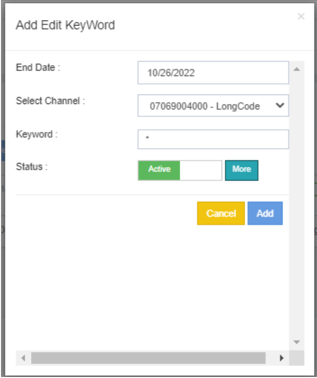

---

### Étape 3: Configuration des règles de routage MO
1. Allez à **MO Règles d'acheminement**.
2. Créer ou modifier une règle :
   - Nom de la règle, date de début/fin
   - Interface de passerelle : HTTP/SMPP
   - Conditions: Origine, Destination, Message
   - Utilisateur & Endpoint: HTTP Webhook ou ESME

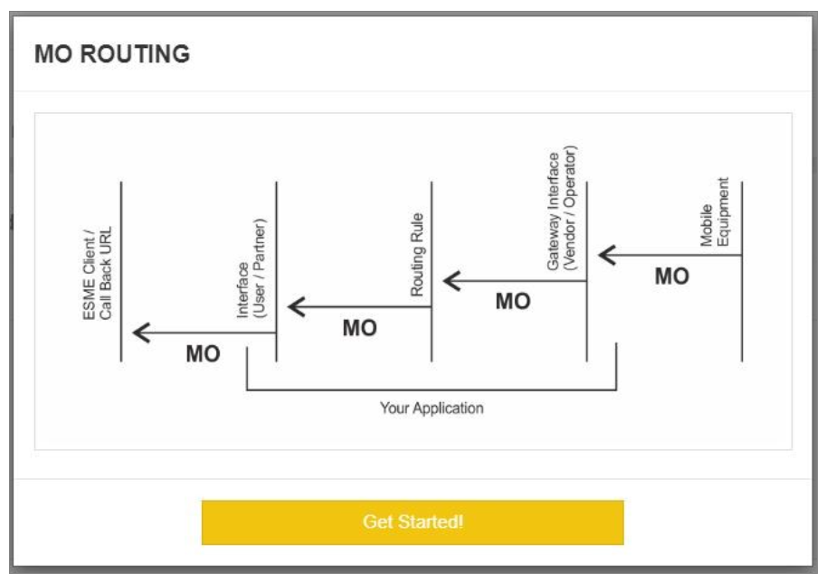 
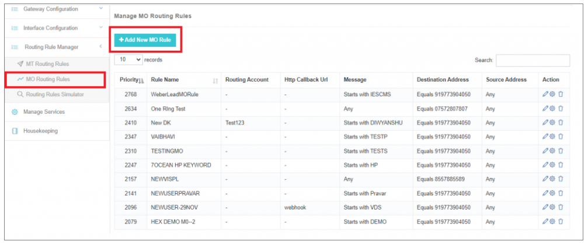 
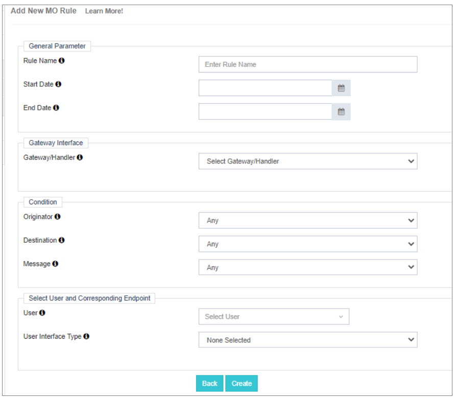

---

## Accès au module MO
1. Impression/Connexion au compte utilisateur.
2. Ouvrir **Module MO** pour voir les messages MO.

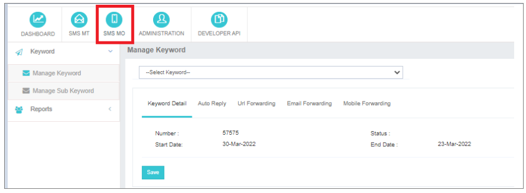 
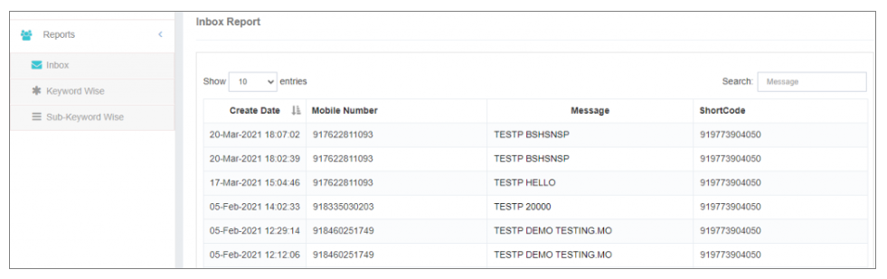 
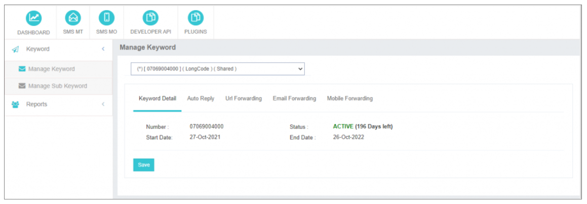

---

## Réponse automatique
- Définir les réponses automatisées pour les messages MO.

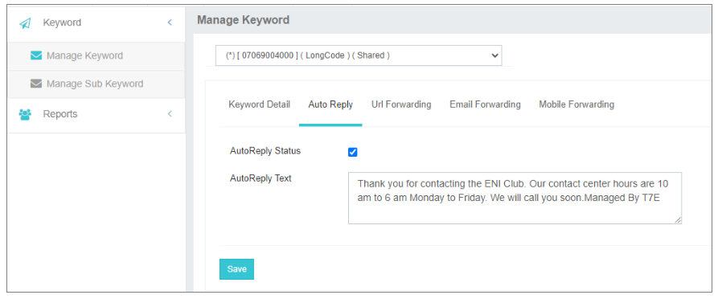

---

## Notifications
- **Transmission des courriels** – Recevez les alertes MO par email. 
- **Transmission mobile** – Recevez des alertes par SMS (incluez le code pays).

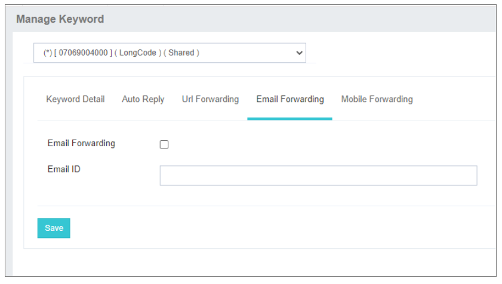

---

## Gérer le sous-mot clé
Les mots-sous-clés sont des déclencheurs secondaires après le mot-clé principal.

**Exemple :**
- **Mot-clé principal :** République tchèque 
- **Réponse automatique:** 
 <span data-ph="0"></span>
- **Sous-mot clé 1:** OUI → <span data-ph="0"></span> 
- **Sous-mot clé 2:** AUCUNE → <span data-ph="0"></span>

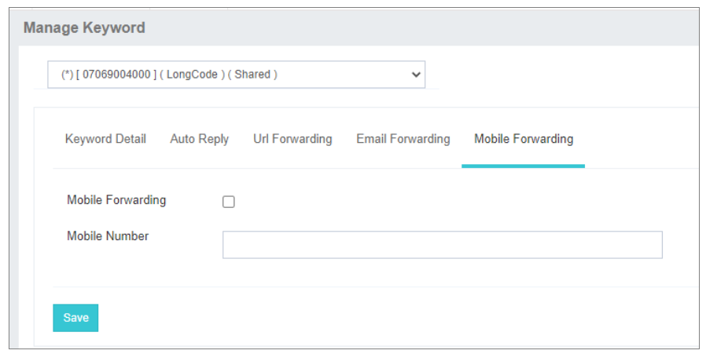

---

## Rapports
- Exporter les rapports MO vers Excel.
- Filtrer par mots clés ou sous-mots clés.

**Étapes :**
1. Allez à **Rapports**.
2. Cliquez sur **Rapport sur les exportations**.
3. Télécharger et personnaliser.

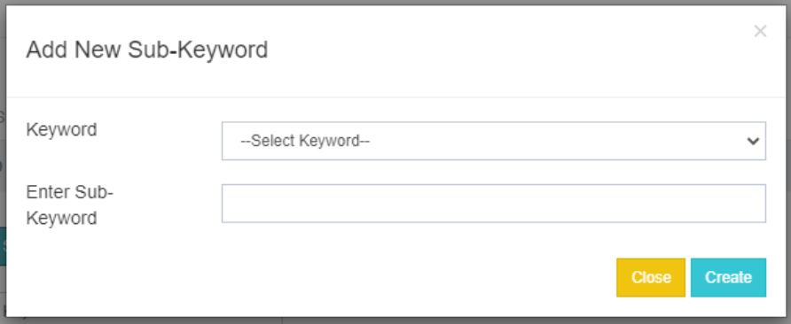 
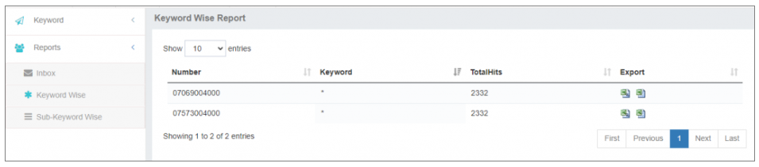

---

## Boucliers Web MO
Livraison de messages MO en temps réel à un paramètre HTTP donné.

**Configuration & #160;:**
1. Activer **Push Web HTTP** dans le compte parent.
2. Allez à **Boucliers Web MO** → **Ajouter un nouveau Webhook**.
3. Jeu & #160;:
   - Nom
   - URL d'extrémité
   - Méthode : GET/POST
   - Artisan: MO

**Remarque:** 
Si le paramètre n'est pas accessible, le MO est rejeté. Le délai est de 10 secondes.

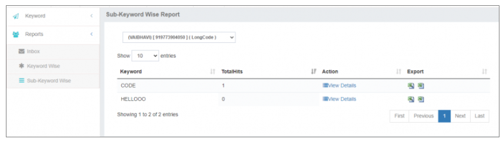 
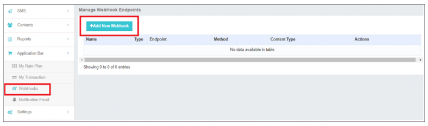