# MO

## Definition
MO messages (**Mobile Originated** messages) are initiated by mobile phone users and sent to dedicated shortcodes or long code numbers using specific keywords.  
They allow customers or subscribers to interact directly with vendors or applications.

---

## Process

### User Initiation
A customer sends a text message with a specific keyword to a dedicated shortcode or long code.

**Example:**  
`Cars` → `57547`

### Message Routing
The message is routed to the application or vendor linked to that shortcode or number.

---

## Key Points
- Enables two-way communication between users and vendors.
- Uses specific keywords to trigger responses.
- Works via dedicated shortcodes or long codes.

---

## HTTP MO Handlers Configuration

### Overview
HTTP MO Handlers in **iTextPro** receive incoming MO messages from vendors.  
Payload structures can differ between vendors.

### Step 1: Add a New Handler
1. Click **Add New Handler**.
2. Map payload parameters in the UI.

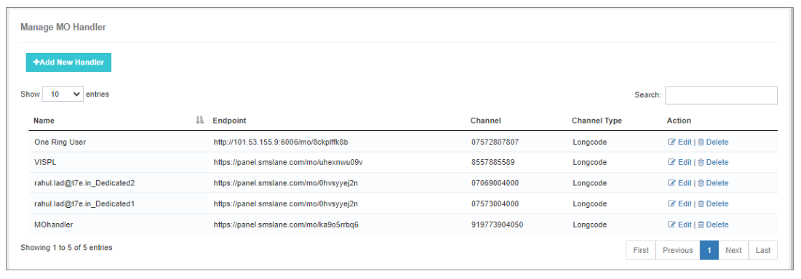

**Prerequisites:**  
Basic understanding of RESTful APIs.

**Example (Vendor: Airtel):**
```json
{
  "originatorAddress": "999563256",
  "destinationAddress": "8754321565",
  "messageContent": "BINGO 101",
  "CustomerId": "669912"
}
```

**iTextPro Config:**
- Method: `POST HTTP/1.1`
- Content Type: `application/json`
- Originator Key: `originatorAddress`
- Destination Key: `destinationAddress`
- Message Key: `messageContent`

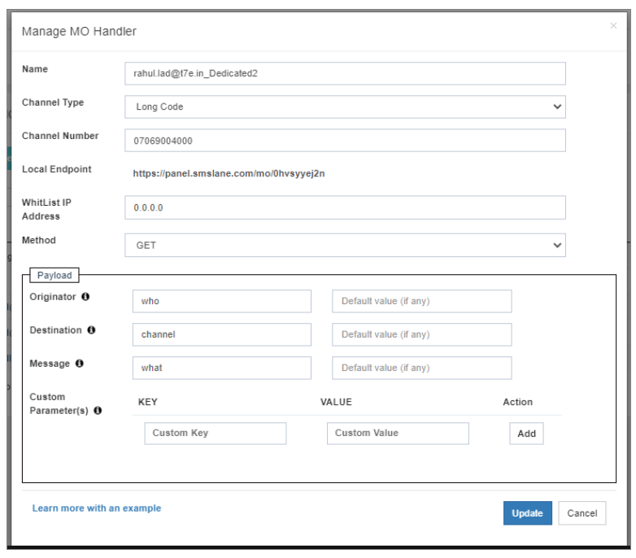

---

### Step 2: Configure MO Services for User Account
1. Log in to iTextPro → locate the user account.
2. Activate **MO Services** in **Manage Services**.
3. Set MO Number & Keyword:
   - End Date
   - Select Channel (MO number)
   - Keyword (or `*` for all)
   - Status: Active
4. Click **Add**.

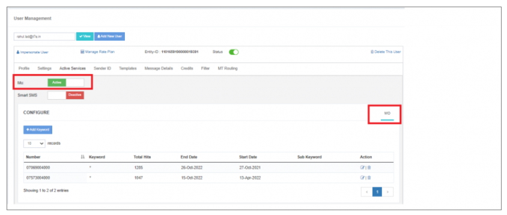  
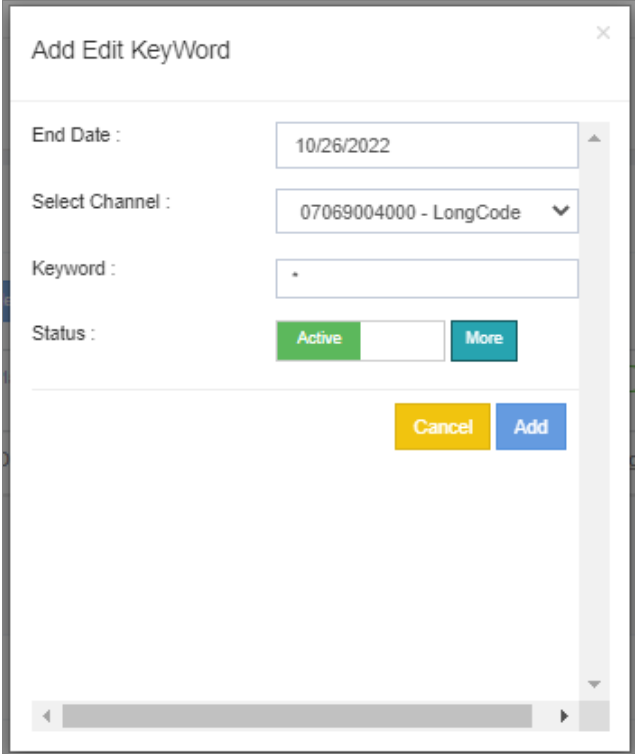

---

### Step 3: MO Routing Rule Configuration
1. Go to **MO Routing Rule**.
2. Create or edit a rule:
   - Rule Name, Start/End Date
   - Gateway Interface: HTTP/SMPP
   - Conditions: Originator, Destination, Message
   - User & Endpoint: HTTP Webhook or ESME

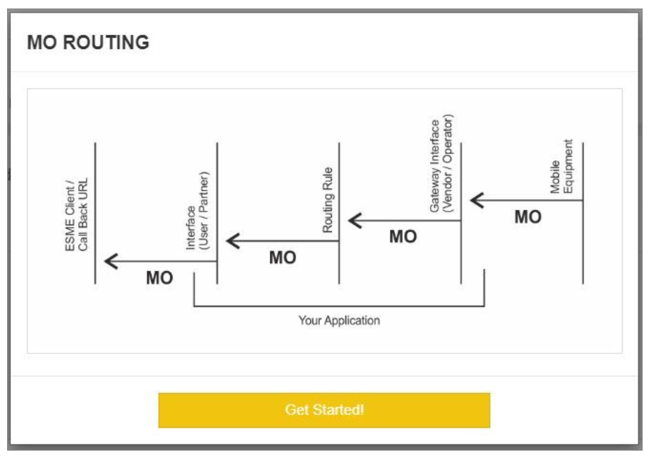  
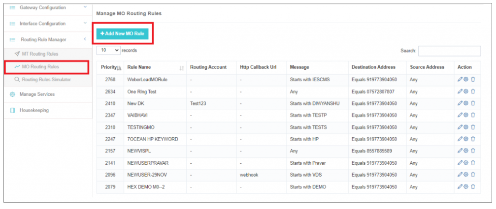  
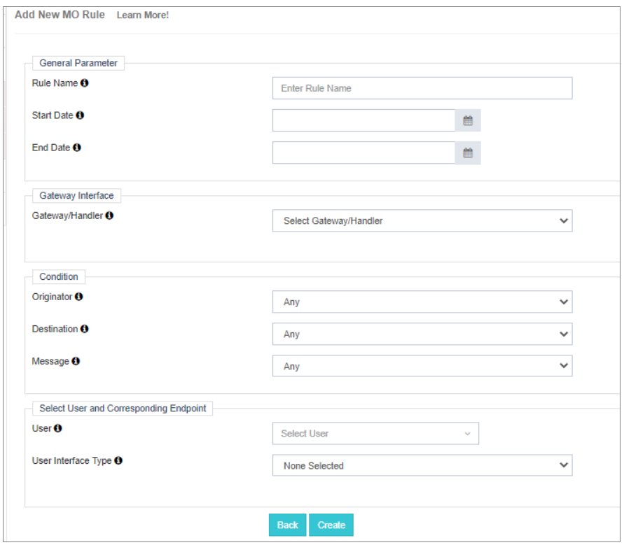

---

## MO Module Access
1. Impersonate/Login to user account.
2. Open **MO Module** to view MO messages.

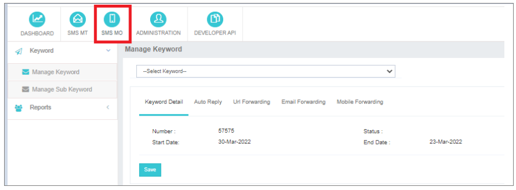  
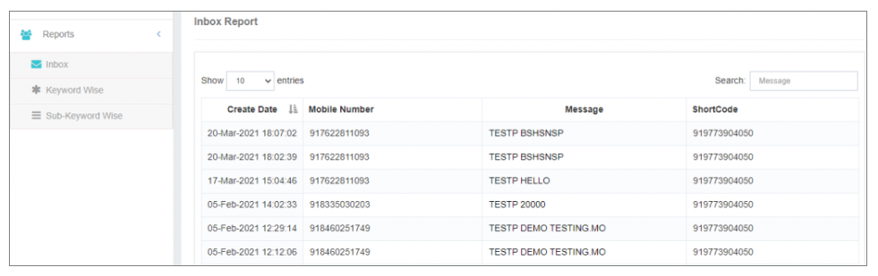  
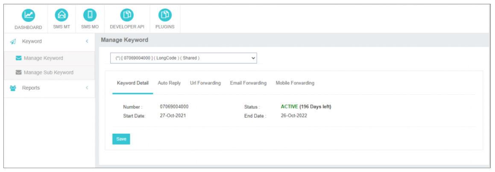

---

## Auto Reply
- Set automated replies for MO messages.

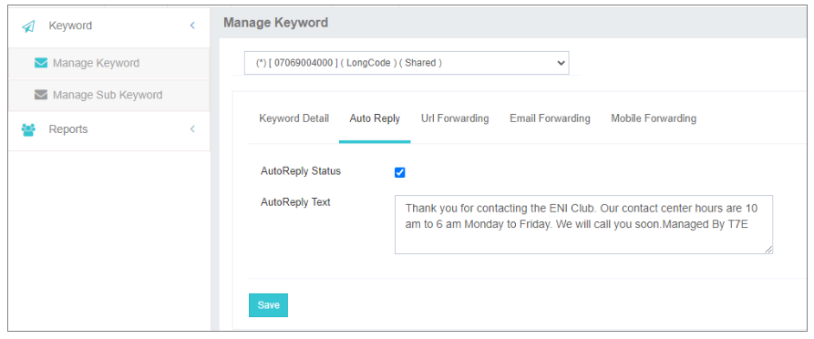

---

## Notifications
- **Email Forwarding** – Receive MO alerts by email.  
- **Mobile Forwarding** – Receive alerts via SMS (include country code).

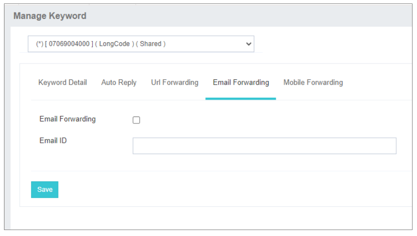

---

## Manage Sub-keyword
Sub-keywords are secondary triggers after the main keyword.

**Example:**
- **Main Keyword:** CAR  
- **Auto-response:**  
  `"Thank you for joining! Was our service beneficial? Reply YES or NO."`
- **Sub-keyword 1:** YES → `"Thanks for your feedback!"`  
- **Sub-keyword 2:** NO → `"Please contact support at 6584XXX"`

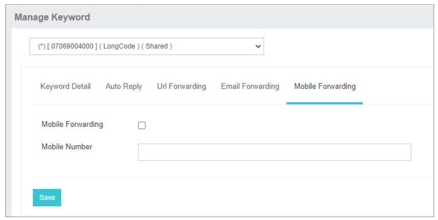

---

## Reports
- Export MO reports to Excel.
- Filter by keywords or sub-keywords.

**Steps:**
1. Go to **Reports**.
2. Click **Export Report**.
3. Download and customize.

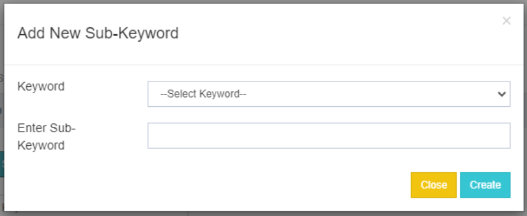  
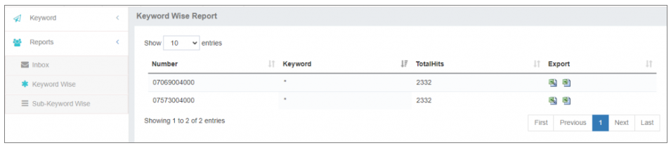

---

## MO Webhooks
Real-time MO message delivery to a given HTTP endpoint.

**Setup:**
1. Enable **HTTP Web Push** in parent account.
2. Go to **MO Webhooks** → **Add New Webhook**.
3. Set:
   - Name
   - Endpoint URL
   - Method: GET/POST
   - Handler: MO

**Note:**  
If the endpoint is unreachable, the MO is discarded. Timeout is 10 seconds.

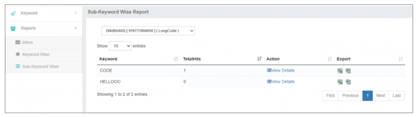  
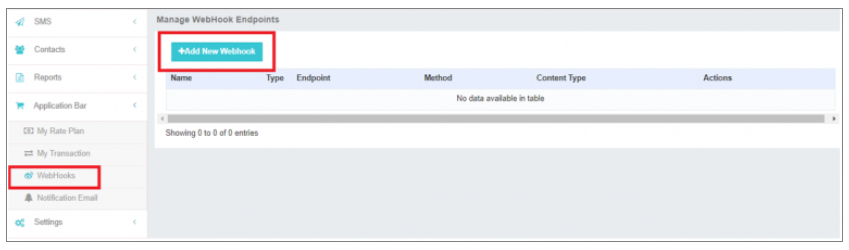