# Smart SMS

## Smart SMS User Guide

### Introduction
Welcome to **Smart SMS**, the ultimate solution for Smart Messaging that not only enriches mobile engagement with your customers but also empowers you with cutting-edge data analytics.  
This comprehensive guide will walk you through the features and functionalities of Smart SMS, ensuring you make the most out of this powerful tool.

---

## Smart Link

### Shortened URLs with Tracking
The **Smart Link** feature simplifies the process of inserting long URLs into your messages. The application automatically shortens the URL for you, providing a significant advantage — the ability to **track and store mobile numbers** when recipients interact with the smart link.

---

## User Dashboard

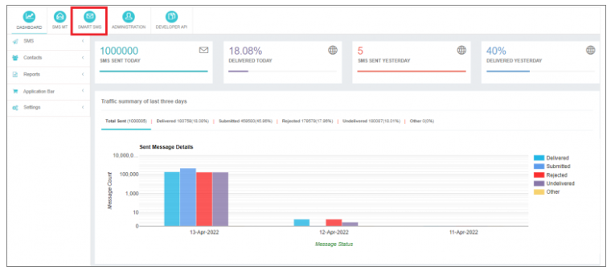

### Proactive Monitoring
Upon logging into your user account, you'll be greeted with the **user dashboard**. This dashboard offers valuable insights into your SMS traffic, allowing you to proactively monitor:
- Traffic patterns
- Traffic summary
- Delivery percentages

Stay informed and in control of your messaging strategy.

---

## Composing Smart SMS

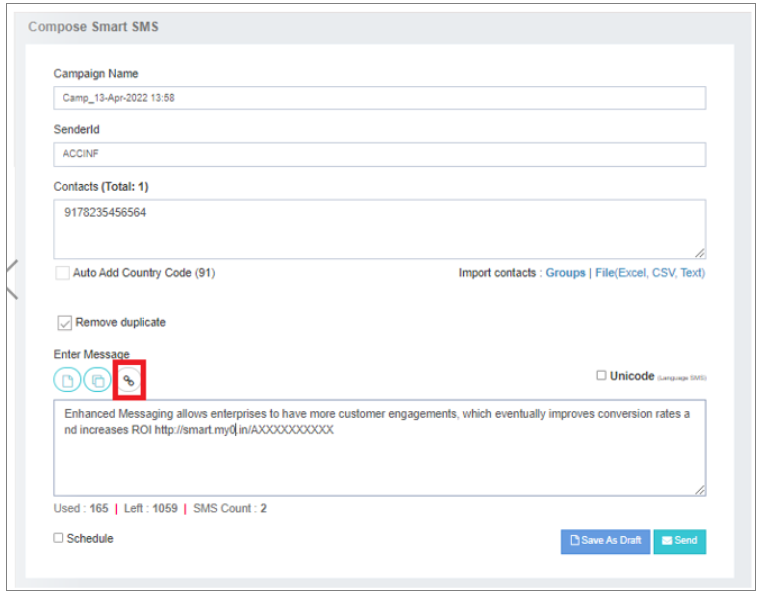

### Creating A2P Smart SMS Campaigns
Navigate to the **Smart SMS** option to access the compose page, where you can craft **A2P (Application-to-Person)** smart SMS campaigns.

#### Campaign Name
- Give your campaign a friendly name.
- A default name is generated automatically with the current date-time and the `"Camp_"` prefix.

#### Sender ID
- Choose an approved Sender ID from the dropdown menu.
- If the **Open Sender ID** option is enabled, enter a dynamic Sender ID in the text box.
- This ID appears as the sender’s address on the recipient’s mobile.

#### Contacts
- Select contacts from groups, upload local files, or manually enter contacts.
- Mobile numbers should be comma-separated, starting with a country code (without `+`).
- Optionally, enable **Auto Add Country Code** under the *My Profile* tab.

#### Enter Message
- Access the last 5 messages by clicking the "Enter Message" text box.
- A counter at the bottom indicates message length and count.

#### Drafts And Templates
- Choose content from saved drafts or templates.
- Drafts can be fully edited, while template modifications are limited to placeholders.

#### Flash
- Enable the **Flash** option to deliver messages directly to the handset screen.

#### Unicode
- Automatically detect Unicode message contents and check the Unicode box.

#### Schedule
- Save your message as a draft or schedule for future execution.
- Defaults to your profile’s time zone.

---

## Insert Smart Link

### Embedding URLs in Your SMS
Click on the insert link icon to:
- Enter a web link URL **or**
- Upload a file

The Smart SMS engine shortens the URL into a **smart link**, seamlessly embedded in the SMS.

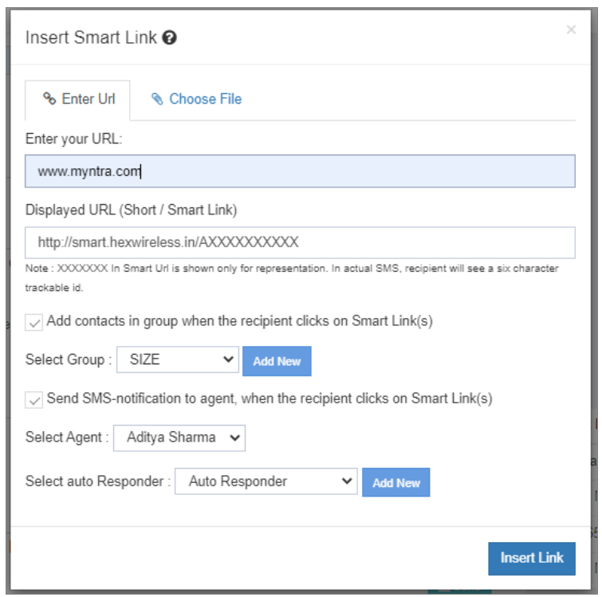  
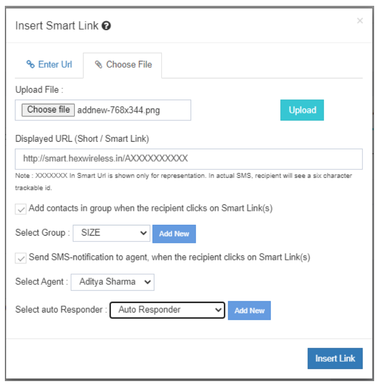

#### Additional Options:
- **Add Contacts in Groups** — Automatically add the recipient’s mobile number to a selected group when they click the smart link.
- **Send SMS Notification to Agent** — Send an SMS alert to a selected agent when the recipient clicks the smart link.

After inserting the link, the shortened URL appears in the message content.  
Click **Send** to execute your Smart SMS campaign.

---

## Smart SMS Reports

### Campaign Reports

#### Campaign View
Provides a consolidated list of Smart SMS campaigns executed by the user.

#### List View
Offers a consolidated Delivery Receipt (DLR) report for Smart SMS campaigns.

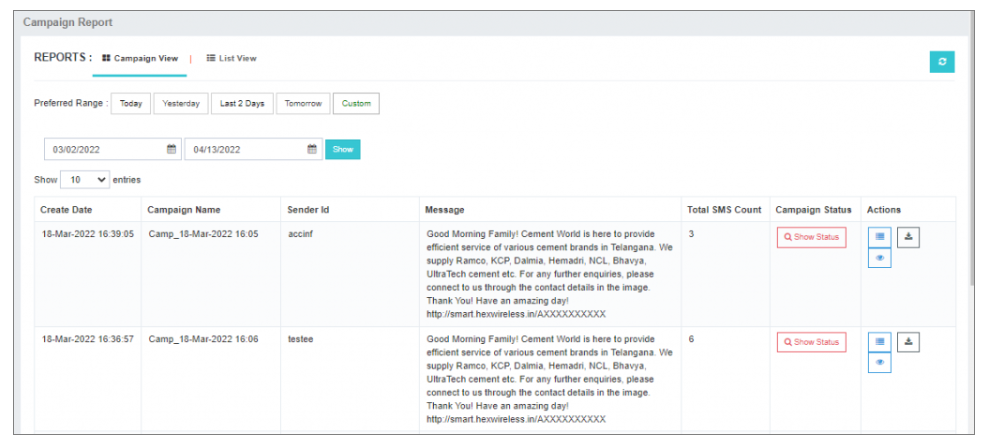

---

### Campaign Status
After executing a campaign, navigate to **Show Campaign Status** to:
- View the message queue and completion status.
- Stop a campaign mid-process.

---

### Actions
View message status-wise counts of executed campaigns.

---

### Download Report
Download Smart SMS campaign reports in **Excel** format for analysis.

---

## Advanced Campaign Reporting Analytics

### Track Campaign
Click **Track Campaign** to access:

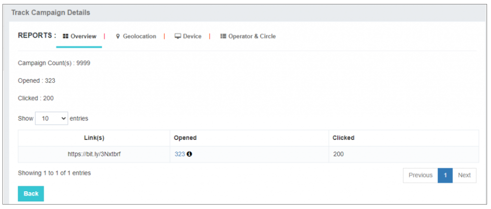

- **Overview** — Total opens and clicks.
- **Opened** — Unique mobile numbers that clicked the link.
- **Export** — Download click reports in Excel format.
- **Clicked** — Total clicks per mobile number.

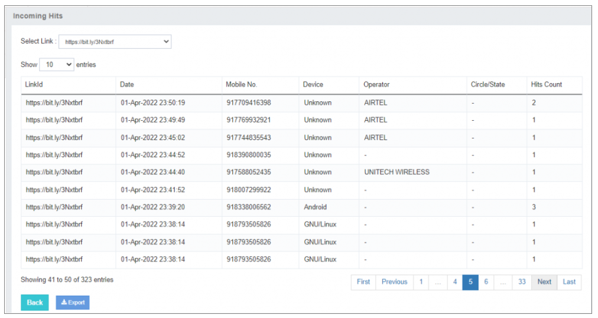

---

### Geolocation/Device
Analytics on where and on which device the link was clicked.  
Helps optimize campaigns for targeted reach.

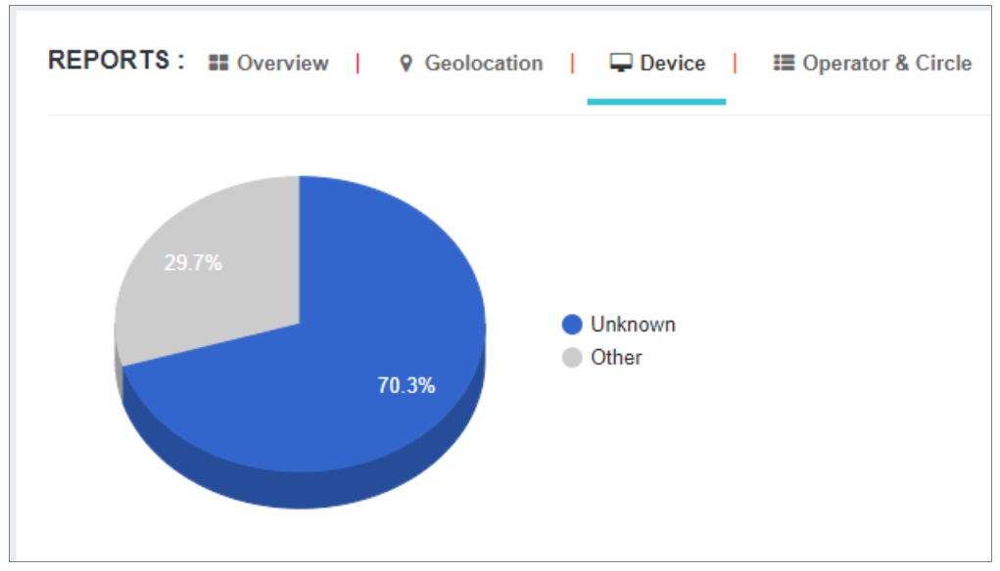  
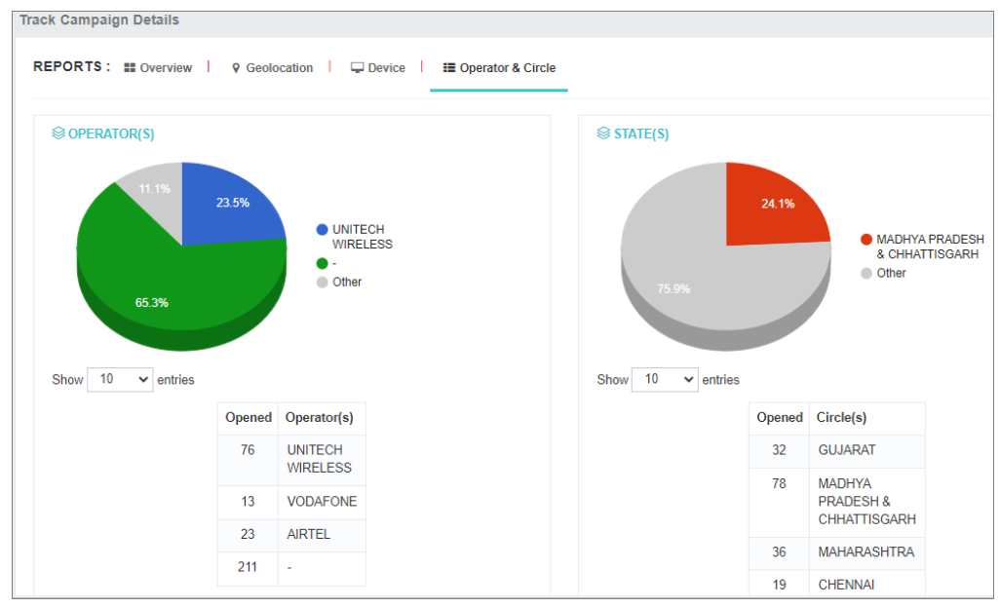

---

## Manage Agents and Auto Responders

### Manage Agents
The **Manage Agents** feature allows SMS alerts to be sent to selected agents if recipients click the smart link.

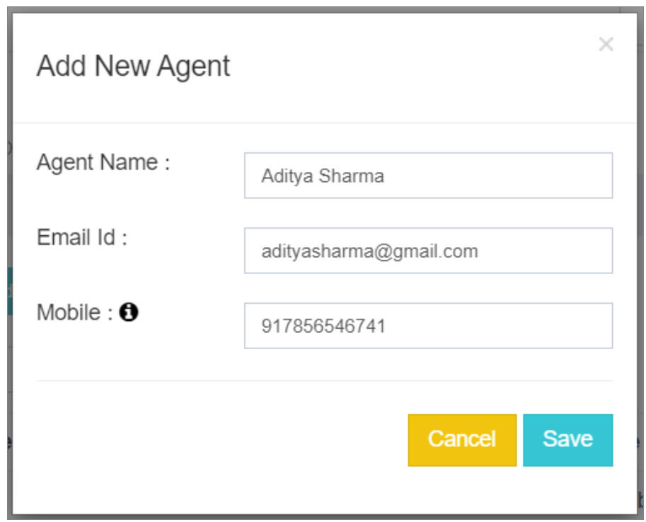

**Steps:**
1. Enter the agent's name and email address.
2. Click **Save**.
3. An OTP is sent to the entered email.
4. The agent verifies the OTP.
5. The agent is listed in **Manage Agents**.

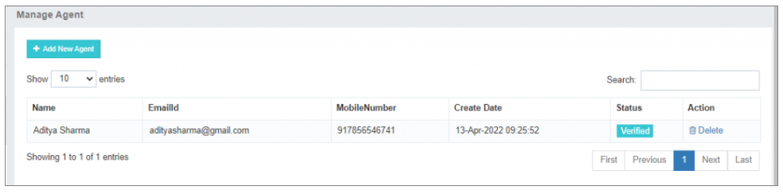

---

### Manage Auto-responders
The **Manage Auto-responders** option lets you configure automated replies to agents.

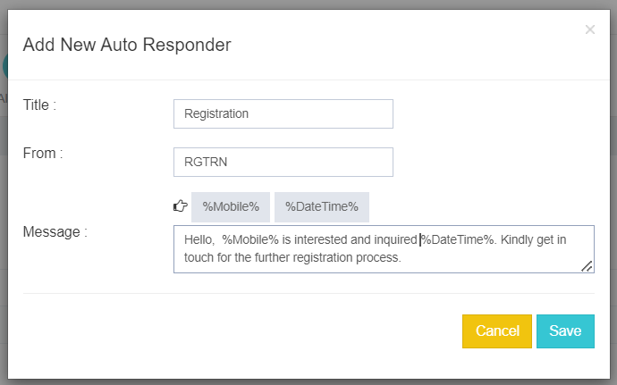

#### Auto-Responder Setup
- Add a **title** for the auto-responder.
- Enter the **sender ID** for message delivery.
- Craft the **message** to send to the selected agent.

#### Placeholders for Dynamic Content
Use placeholders for **mobile number** and **date-time** to give agents detailed information.

#### Industry Applications
- Valuable for industries aiming to enhance communication efficiency.
- Ideal for **lead generation**.
- Enables prompt responses and automation.

---

By using **Manage Agents** and **Auto Responders** in Smart SMS, organizations can streamline communication, ensure timely responses, and maximize productivity.
