# SMS inteligente

## Guia de usuário Smart SMS

### Introdução
Bem- vindo a **SMS inteligente**, a solução final para Mensagens Inteligentes que não só enriquece o engajamento móvel com seus clientes, mas também o capacita com análises de dados de ponta. 
Este guia abrangente irá levá-lo através dos recursos e funcionalidades de Smart SMS, garantindo que você tirar o máximo proveito desta ferramenta poderosa.

---

## Ligação Inteligente

### URLs encurtados com Rastreamento
A **Ligação Inteligente** o recurso simplifica o processo de inserção de URLs longas em suas mensagens. O aplicativo encurta automaticamente a URL para você, proporcionando uma vantagem significativa — a capacidade de **rastrear e armazenar números móveis** quando os destinatários interagem com o link inteligente.

---

## Painel de usuário

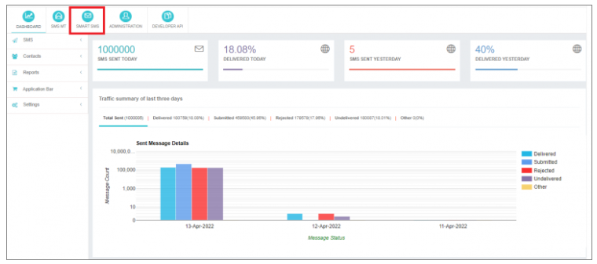

### Monitorização Proativa
Ao entrar em sua conta de usuário, você será recebido com o **painel de usuário**Este painel oferece informações valiosas sobre o tráfego de SMS, permitindo que você monitore proativamente:
- Padrões de tráfego
- Resumo do tráfego
- Percentagens de entrega

Mantenha-se informado e no controle de sua estratégia de mensagens.

---

## Compondo SMS inteligente

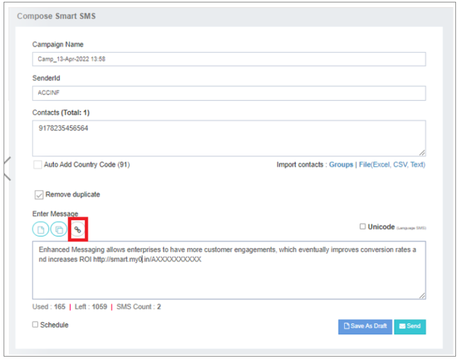

### Criando campanhas SMS inteligentes A2P
Navegar para o **SMS inteligente** opção para acessar a página de composição, onde você pode criar **A2P (Aplicação à Pessoa)** campanhas SMS inteligentes.

#### Nome da Campanha
- Dê um nome amigável à sua campanha.
- Um nome padrão é gerado automaticamente com a data- hora atual e o  prefixo.

#### ID do remetente
- Escolha um ID do remetente aprovado no menu suspenso.
- Se a **Abrir o ID do remetente** opção está habilitada, digite um ID de remetente dinâmico na caixa de texto.
- Este ID aparece como endereço do remetente no celular do destinatário.

#### Contactos
- Selecione contatos de grupos, envie arquivos locais ou digite contatos manualmente.
- Os números móveis devem ser separados por vírgulas, começando com um código de país (sem ).
- Opcionalmente, ativar **Adicionar automaticamente o código do país** sob a *Meu Perfil* tab.

#### Digite a mensagem
- Acesse as últimas 5 mensagens clicando na caixa de texto "Enter Mensagem".
- Um contador na parte inferior indica o comprimento da mensagem e a contagem.

#### Rascunhos e Modelos
- Escolha conteúdo de rascunhos ou modelos salvos.
- Os rascunhos podem ser totalmente editados, enquanto as modificações do modelo são limitadas aos placeholders.

#### Flash
- Activar a **Flash** opção para entregar mensagens diretamente na tela do aparelho.

#### Unicode
- Detecte automaticamente o conteúdo da mensagem Unicode e marque a caixa Unicode.

#### Agendar
- Salve sua mensagem como um rascunho ou agenda para execução futura.
- Padrões para o fuso horário do seu perfil.

---

## Inserir uma Ligação Inteligente

### Incorporando URLs em seu SMS
Clique no ícone inserir link para:
- Digite um URL de link web **ou**
- Enviar um ficheiro

O mecanismo Smart SMS encurta o URL em um **ligação inteligente**, perfeitamente incorporado no SMS.

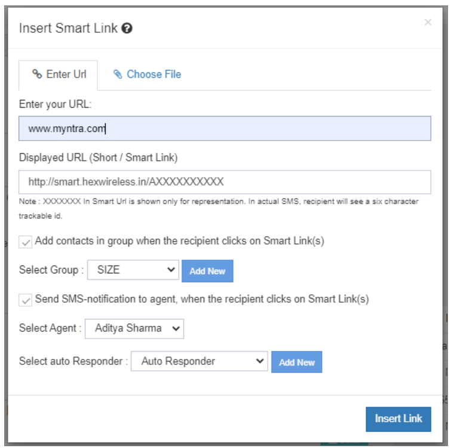 
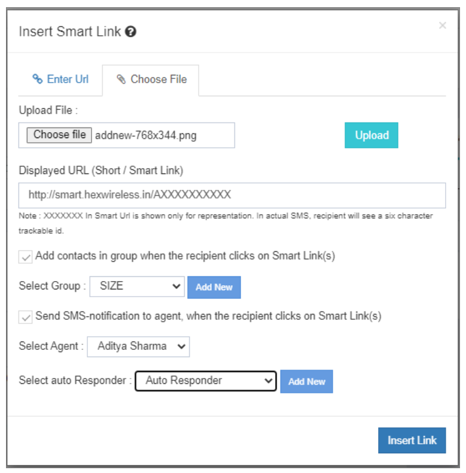

#### Opções adicionais:
- **Adicionar contatos em grupos** — Adicione automaticamente o número de telemóvel do destinatário a um grupo seleccionado quando este clicar no link inteligente.
- **Enviar notificação de SMS ao Agente** — Envie um alerta SMS para um agente seleccionado quando o destinatário clicar no link inteligente.

Após inserir o link, o URL encurtado aparece no conteúdo da mensagem. 
Clique **Enviar** para executar sua campanha Smart SMS.

---

## Relatórios SMS inteligentes

### Relatórios de Campanha

#### Área de Campanha
Fornece uma lista consolidada de campanhas SMS Smart executadas pelo usuário.

#### Vista da Lista
Oferece um relatório consolidado do Recibo de Entrega (DLR) para campanhas SMS Smart.

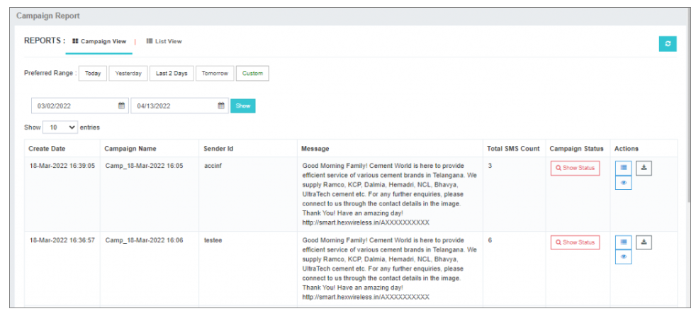

---

### Estado da Campanha
Após executar uma campanha, navegue para **Mostrar o Estado da Campanha** a:
- Veja a fila de mensagens e o estado de conclusão.
- Pare uma campanha no meio do processo.

---

### Acções
Ver as contagens de status das campanhas executadas.

---

### Baixar relatório
Baixar relatórios de campanha Smart SMS **Excel** formato para análise.

---

## Análise avançada de relatórios de campanha

### Campanha da Faixa
Clique **Campanha da Faixa** ao acesso:

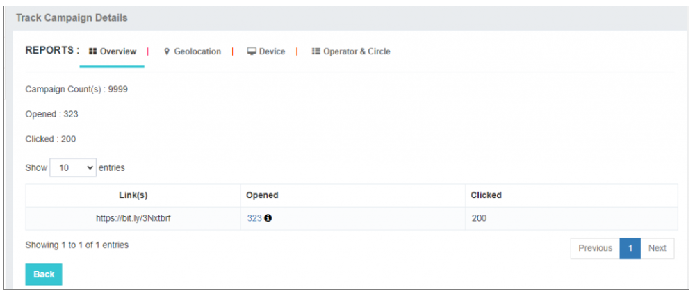

- **Visão geral** — Total das aberturas e cliques.
- **Aberto** — Números móveis únicos que clicaram no link.
- **Exportar** — Faça download de relatórios em formato Excel.
- **Clicado** — Total de cliques por número de telemóvel.

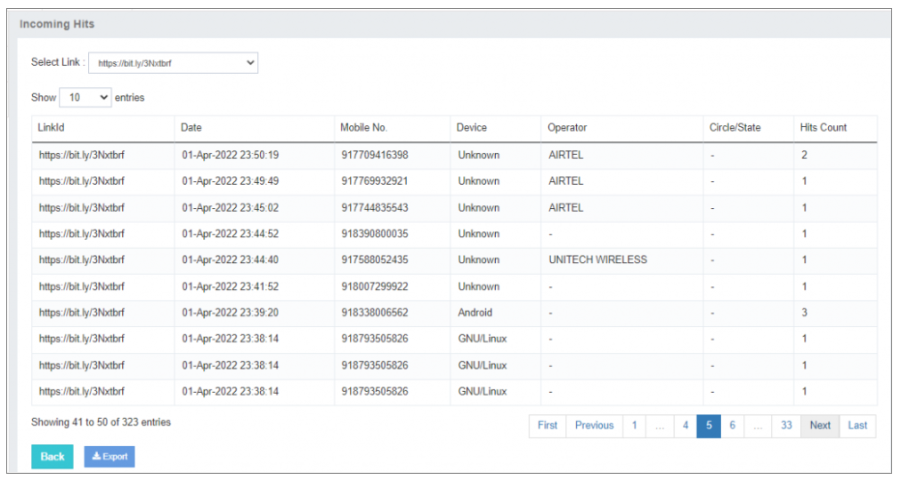

---

### Geolocalização/Dispositivo
Análise de onde e em que dispositivo o link foi clicado. 
Ajuda a otimizar campanhas para alcance direcionado.

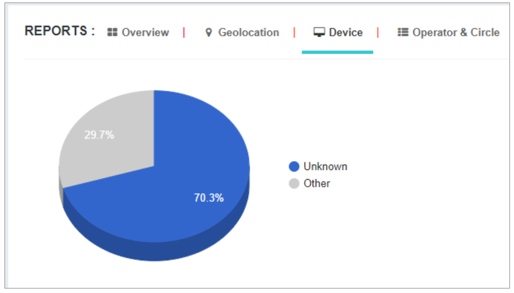 
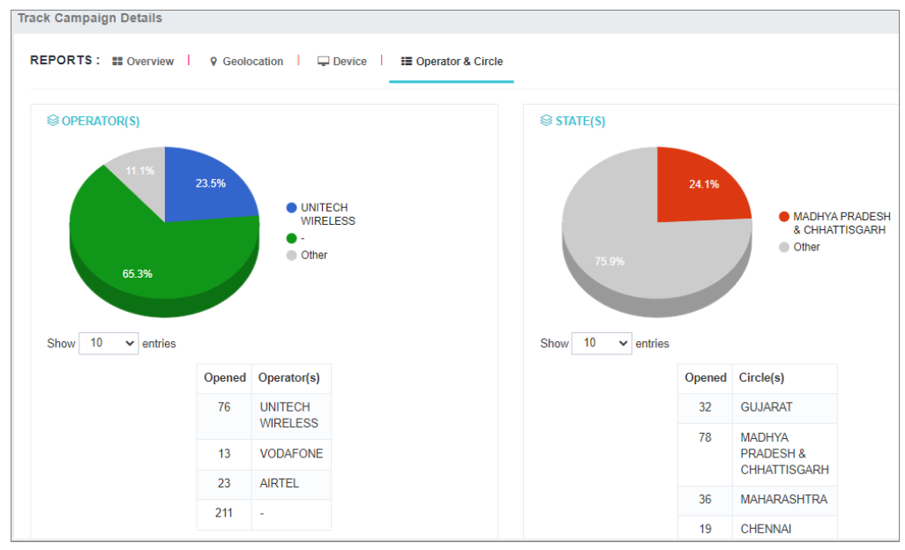

---

## Gerencie Agentes e Respostas Automáticas

### Gerenciar agentes
A **Gerenciar agentes** O recurso permite que os alertas SMS sejam enviados para agentes selecionados se os destinatários clicarem no link inteligente.

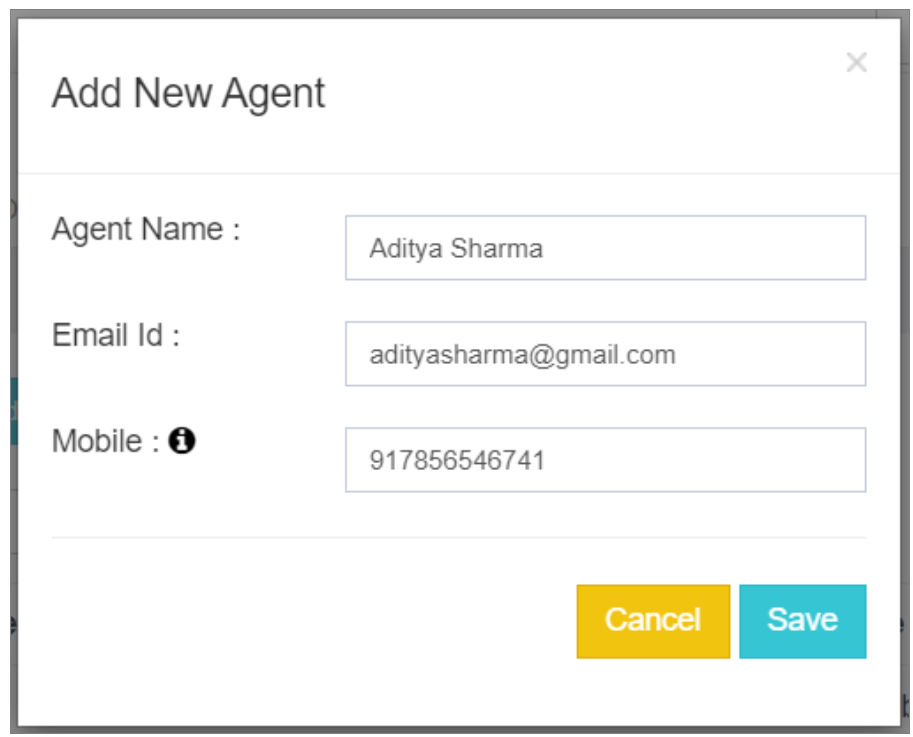

**Passos:**
1. Digite o nome e endereço de e-mail do agente.
2. Clique **Gravar**.
3. Um OTP é enviado para o e- mail introduzido.
4. O agente verifica o OTP.
5. O agente está listado em **Gerenciar agentes**.

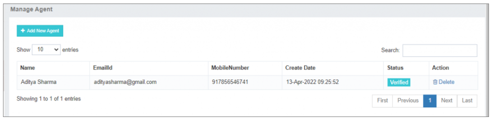

---

### Gerenciar respostas automáticas
A **Gerenciar respostas automáticas** a opção permite configurar as respostas automatizadas aos agentes.

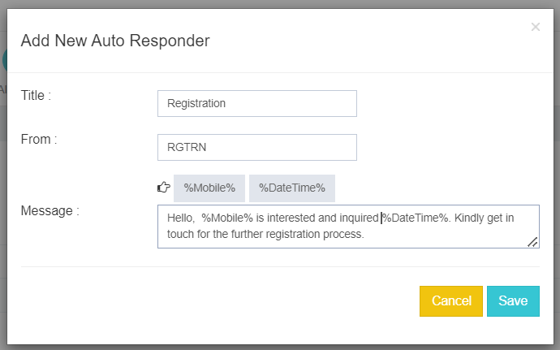

#### Configuração do Auto- Resposta
- Adicionar um **título** para o respondedor automático.
- Digite o **ID do remetente** para entrega de mensagens.
- Criar o **mensagem** para enviar para o agente selecionado.

#### Lugares para Conteúdo Dinâmico
Usar espaços para **número de telemóvel** e **data- hora** fornecer aos agentes informações pormenorizadas.

#### Aplicações da Indústria
- Valioso para indústrias que visam aumentar a eficiência da comunicação.
- Ideal para **geração de chumbo**.
- Permite respostas rápidas e automação.

---

Usando **Gerenciar agentes** e **Respostas Automáticas** Em Smart SMS, as organizações podem simplificar a comunicação, garantir respostas oportunas e maximizar a produtividade.
