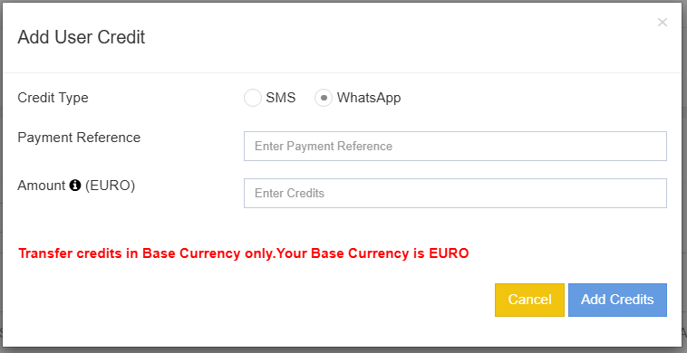
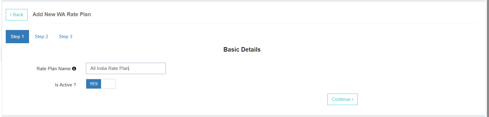
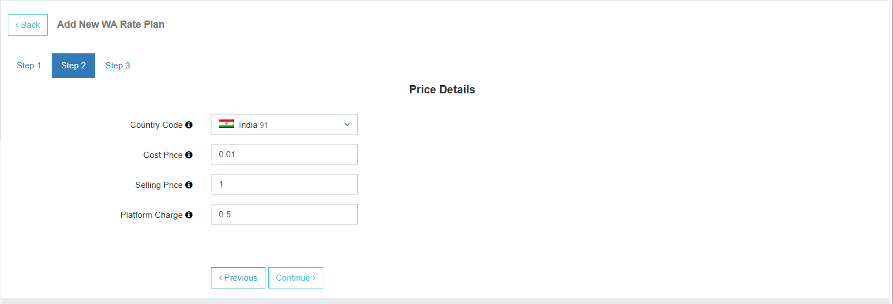

# Administration - WhatsApp Module

## 1. Active Service Description
**WhatsApp:**  
By enabling this plugin, the user will be able to:
- Access and send out messages via WhatsApp.
- Configure chatbots for automated responses for their businesses.

---

## 2. Credits
- Users have a **separate wallet balance for WhatsApp**.
- The admin can view the credit balance for **SMS messaging** and **WhatsApp** separately.

**Steps to Add Credits:**
1. Click **Add New** to add credits to the user's balance.
2. Select **WhatsApp** from the service list.
3. Enter a **payment reference**.
4. Enter the **amount**.
5. Click **Add Credits** to top-up the user's balance.

---

## 3. User Rate Plan
In the WhatsApp section, you can assign the **rate plan** to be applied to the user.

- Select the rate plan from the dropdown menu.
- All rate plans configured in the **Billing** section will appear here for selection.

---

### WhatsApp Rate Plans
Similar to the MT message rate plans, the admin must define **WhatsApp-specific rate plans** to manage billing.

**Actions Available:**
1. **Edit** – Change the rate plan name or enable/disable the plan.
2. **View** – View and modify all prices configured in the rate plan. Updates will apply to all assigned users.
3. **Copy** – Duplicate an existing rate plan with a new name.
4. **Delete** – Remove a rate plan permanently. *(Cannot be undone)*

---

## Creating a New Rate Plan

**Step 1:**  
- Enter the **Friendly Rate Plan Name**.
- Choose **Active/Inactive** status.
- Click **Continue**.

---

**Step 2:**  
- Define prices for the rate plan.
- Configure billing details for the user.

**Fields:**
- **Country Code** – Select the applicable country.
- **Cost Price** – The amount charged by META per message.
- **Selling Price** – The price charged to the user per message.
- **Platform Charge** – Optional fee for using your platform.

---

### Use Cases

**Case 1:**  
- Billing with META handled by admin.  
- No platform fee charged.  
- **Credits deducted** as per *Selling Price*.

**Case 2:**  
- Billing with META handled by user.  
- Only platform fee is charged.  
- **Selling Price** kept as `null`.

**Case 3:**  
- Admin charges both Selling Price and Platform Fee.  
- Credits deducted as **Selling Price + Platform Fee**.

---

**Step 3:**  
- Review the **rate plan summary**.
- Ensure all details are correct.
- Click **Save** to finalize.

---
