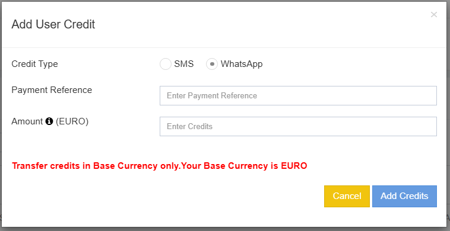
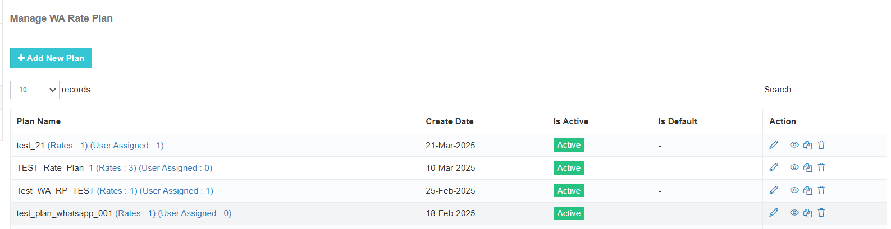
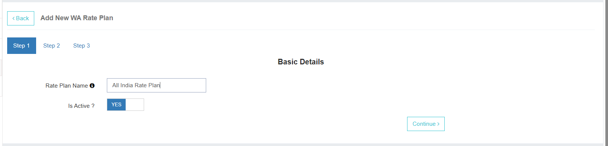
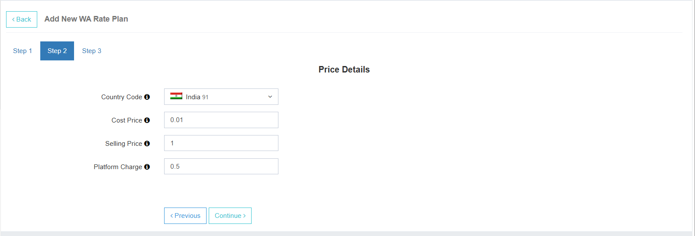

---
tags:
  - WhatsApp
  - Plugin
  - Configuration
---

# Administração - Módulo WhatsApp

## 1. Descrição do serviço ativo
**WhatsApp:** 
Ao habilitar este plugin, o usuário poderá:
- Acesse e envie mensagens através do WhatsApp.
- Configure chatbots para respostas automatizadas para seus negócios.

---

## 2. Créditos
- Os utilizadores têm uma **saldo da carteira separado para WhatsApp**.
- O administrador pode ver o saldo de crédito para **Mensagens SMS** e **WhatsApp** separadamente.

**Passos para adicionar créditos:**
1. Clique **Adicionar um Novo** adicionar créditos ao saldo do utilizador.
2. Selecionar **WhatsApp** da lista de serviços.
3. Digite um **Referência do pagamento**.
4. Digite o **montante**.
5. Clique **Adicionar Créditos** para completar o equilíbrio do usuário.

---

## 3. Plano de Taxa de Usuário
Na seção WhatsApp, você pode atribuir o **Plano de taxas** A aplicar ao utilizador.

- Selecione o plano de taxa no menu suspenso.
- Todos os planos de taxa configurados no **Faturação** a seção aparecerá aqui para seleção.

---

### Planos de Taxa de WhatsApp
Semelhante aos planos de taxa de mensagens MT, o administrador deve definir **Planos de taxa específicos do WhatsApp** para gerir a facturação.

**Acções Disponíveis:**
1. **Editar** – Alterar o nome do plano de taxa ou ativar/desativar o plano.
2. **Ver** – Ver e modificar todos os preços configurados no plano de tarifas. As atualizações serão aplicadas a todos os usuários atribuídos.
3. **Copiar** – Duplicar um plano de taxa existente com um novo nome.
4. **Apagar** – Remova um plano de taxa permanentemente. *(Não pode ser desfeito)*

---

## Criar um Plano de Nova Taxa

**Passo 1:** 
- Digite o **Nome do plano de taxa amigável**.
- Escolher **Activo/Inactivo** Situação.
- Clique **Continuar**.

---

**Passo 2:** 
- Definir preços para o plano de taxas.
- Configurar detalhes de faturamento para o usuário.

**Campos:**
- **Código do país** – Selecione o país aplicável.
- **Preço de Custo** – O valor cobrado pelo META por mensagem.
- **Preço de Venda** – O preço cobrado ao usuário por mensagem.
- **Carga da Plataforma** – Taxa opcional para usar sua plataforma.

---

### Casos de Uso

**Caso 1:** 
- Cobrança com META manuseado pelo administrador. 
- Nenhuma taxa de plataforma cobrada. 
- **Créditos deduzidos** de acordo com *Preço de Venda*.

**Caso 2:** 
- Faturamento com META manipulado pelo usuário. 
- Só é cobrada a taxa da plataforma. 
- **Preço de Venda** mantido como .

**Caso 3:** 
- Taxas de administração tanto vendendo preço e taxa de plataforma. 
- Créditos deduzidos como **Preço de Venda + Taxa de Plataforma**.

---

**Passo 3:** 
- Revisão da **resumo do plano de taxas**.
- Certifique-se de que todos os detalhes estão corretos.
- Clique **Gravar** para finalizar.

---
