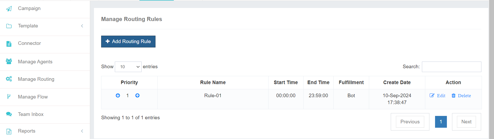
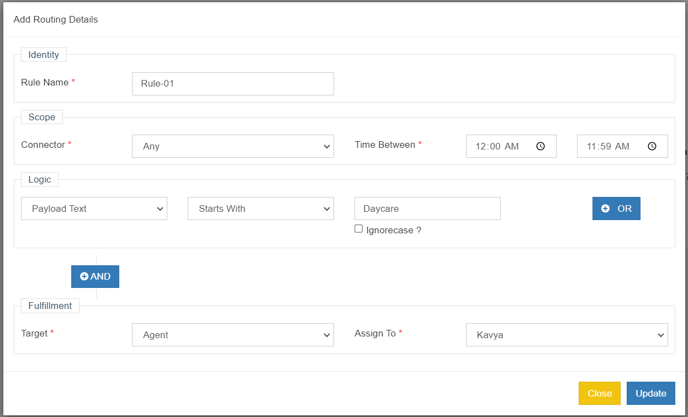

# Smartly Route Conversations with Advanced Routing Rules

With our platform, you can effectively manage the flow of webchat conversations by creating and customizing routing rules. This ensures that each chat is directed to the most appropriate agent or chatbot, optimizing efficiency and customer satisfaction.

## Key Benefits of Routing Rules

- **Efficient Routing**: Automatically route chats based on specific criteria, such as keywords, time of day, or customer intent.
- **Improved Response Times**: Quickly connect customers with the right agents or chatbots.
- **Enhanced Customer Experience**: Provide timely and relevant assistance to improve overall satisfaction.
- **Flexible Customization**: Tailor routing rules to your specific business needs and workflows.

By effectively managing routing rules, you can streamline your webchat operations and deliver exceptional customer experiences.

Click on **Add New Rule** to create a new rule as per your requirement.

