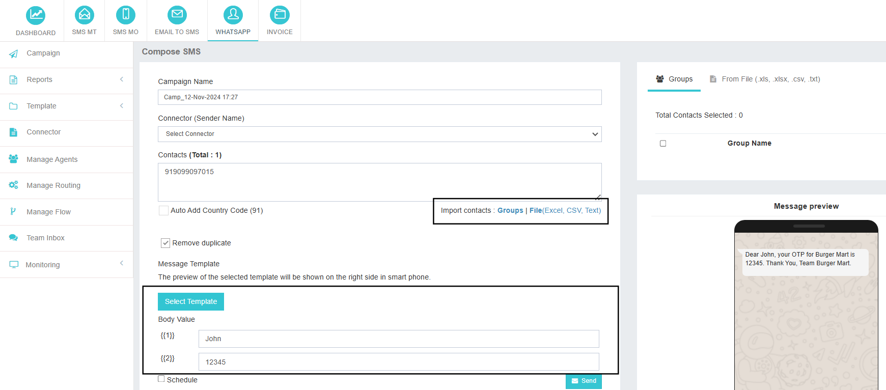

# WhatsApp Campaign

## Initiating a WhatsApp Campaign
Launching a WhatsApp campaign in **iTextPro** is quick and straightforward. Follow these steps to get started:

---

### 1. Navigate to the Campaign Page
- Click on the **"Campaign"** button to access the campaign creation interface.

---

### 2. Select a Sender Name
- Choose the appropriate **sender name** from the dropdown menu.
- By default, the **connector’s name** is used.

---

### 3. Add Your Target Audience
You can add recipients in multiple ways:
- **Manual Entry** – Type in mobile numbers directly into the contact box.
- **Import Contacts** – Upload an **Excel** or **CSV** file containing your contact list.
- **Use Existing Groups** – Select from your already created contact groups.

---

### 4. Choose a Pre-Approved Template
- Click **"Select Template"** to browse a list of approved templates.
- **Preview** any template to ensure it aligns with your campaign goals.

---

### 5. Customize Your Message
- Modify the **header** if needed.
- Replace **dynamic variables** (e.g., `{{1}}`) with specific details like customer names.
- A **real-time preview** on the right shows how your message will appear on the recipient’s device.

---

### 6. Schedule or Send Immediately
- **Schedule** – Check the "Schedule" box and set your desired date and time.
- **Send Now** – Click the **"Send"** button to launch the campaign immediately.

---

By following these steps, you can effectively launch **targeted WhatsApp campaigns** using pre-approved templates, ensuring **efficient** and **compliant communication** with your audience.

---

