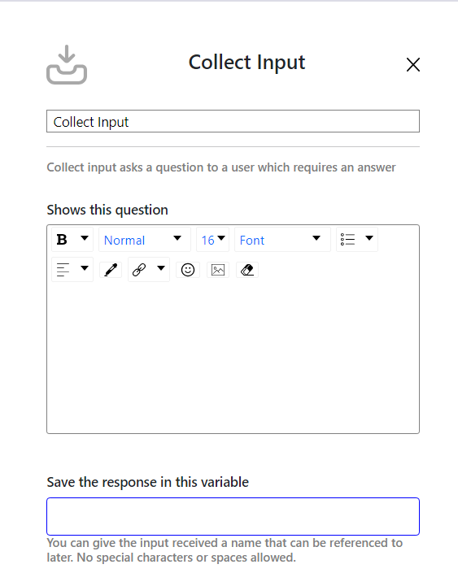

# Manage Flow

Create and customize intelligent chatbots to automate your customer interactions and enhance efficiency. Our platform offers a variety of pre-built templates to help you get started quickly. Simply select a template and tailor it to your specific needs, or start from scratch to build a unique chatbot experience.

If you prefer a completely tailored solution, click the **Build from Scratch** button to create a fully custom flow for your unique use case. This will redirect you to a flow builder window where you can design your chatbot interactions from the ground up.

Here’s an example of what a created flow can look like:

---

## Bot Trigger Condition

To initiate the bot, you must define a specific condition or keyword that triggers its activation. This can be any predefined text or phrase configured to start the interaction.  

In case the initial trigger is unsuccessful, we offer a **retry mechanism** to ensure activation. Additionally, you can configure an **idle timeout**, allowing the bot to automatically follow up with the client after a set period of inactivity.

---

## Flow Options

You can choose from various options to proceed with the flow, such as **Send Message**, **Collect Input**, **Option**, **Branch**, and **Send Attachment**.

---

### 1. Send Message

Enter the title and write the message you want to send in the chat.

---

### 2. Collect Input

Enter a message to display to the user and capture their input.  
The collected input can be stored in a variable for use in deciding the future flow of the conversation.

---

### 3. Option

Provide up to **3 options** for users, as per Meta’s policies.  
The user can select an option, and the flow will continue accordingly. You can also upload an image to be displayed before the message.

---

### 4. Branch

Use previously collected inputs to configure conditional flows.  
Depending on which conditions are met, the chat will proceed differently.

  

---

### 5. Send Attachment

Send any type of attachment, such as documents, photos, or videos, to your users.

