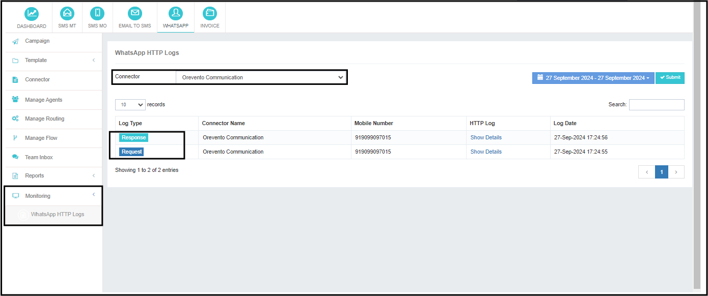

# Monitoring

The **WhatsApp Plugin** offers a dedicated monitoring tool that provides granular insights into the communication between your application and Meta.  
This robust tool tracks every interaction, from requests sent to responses received, ensuring transparency and accountability.

## Key Features

- **Transaction Records**: Tracks all interactions between the application and Meta, logging each request and its corresponding response.
- **Troubleshooting**: Use logs to diagnose issues and troubleshoot any problems that arise during the communication process.
- **Retention Period**: Logs are retained for the last **3 days** only, ensuring up-to-date information while keeping data storage efficient.

This monitoring tool is crucial for ensuring smooth communication between the app and Meta, as well as for resolving any technical issues that may occur.

