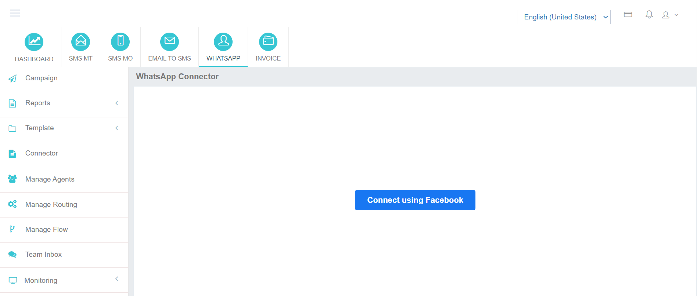
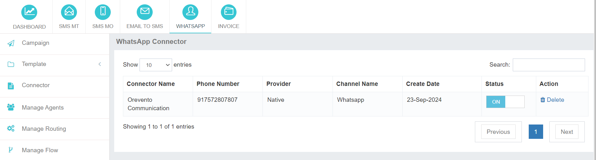

# WhatsApp Usersite Overview

## Introduction
The digital communication landscape is evolving rapidly, with **WhatsApp** emerging as a dominant platform for businesses to engage with their customers.  
**iTextPro** empowers you to harness the full potential of WhatsApp, transforming it into a powerful tool for:
- **Marketing campaigns**
- **Timely updates**
- **Efficient customer support**

By integrating your business operations with WhatsApp, you can:
- Boost **brand visibility**
- Deepen **customer engagement**
- Foster **meaningful connections** with your target audience

---

## Getting Started with WhatsApp Messaging

### Step 1 – Connect Your Facebook Account
To start your WhatsApp messaging journey:
1. Click **"Connect using Facebook"**.
2. A dialogue box will appear prompting you to **register your Facebook account** with iTextPro.

---

### Step 2 – Create Your WhatsApp Business Profile
If you don’t already have one:
- Create a **WhatsApp Business Profile** within your Facebook account.  
- This profile acts as the **bridge** between **Meta** and **iTextPro**.

Once connected:
- You’ll be able to **configure WhatsApp messaging settings** directly in the iTextPro platform.
- This ensures a smooth, secure, and reliable integration.

