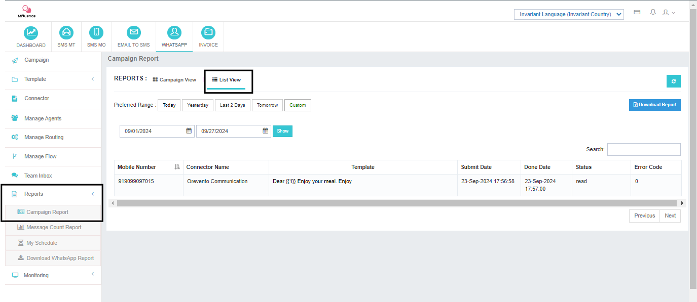

# Report 1: Campaign Report

The **Campaign Report** section provides two views for tracking campaign performance:

---

## Campaign View

- **Overview:** Get a bird's-eye view of your campaigns, including:
  - Campaign name  
  - Sender  
  - Content  
  - Total messages  
  - Status  
  - Cost  

- **Detailed Analysis:** Drill down into specific campaigns to:
  - View message counts by status (delivered, failed, etc.)  
  - Download detailed reports  

---

## List View

- **Message-Level Details:** Dive deep into individual message performance, including:
  - Recipient number  
  - Template used  
  - Submission date  
  - Delivery date  
  - Status  
  - Error codes  

