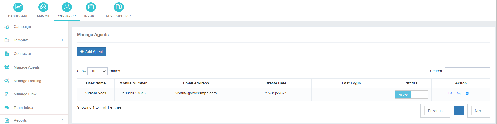
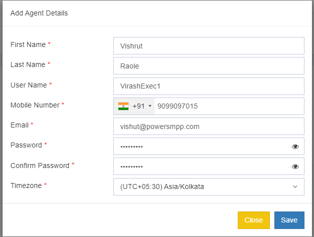

# Efficiently Manage Your Team with Agent Accounts

The **Manage Agents** section empowers you to create individual accounts for your team members, enabling secure access to webchat conversations. By assigning specific agents to different webchat flows, you can optimize your team's efficiency and accountability.

## Key Benefits of Using Agent Accounts

- **Enhanced Team Management**: Organize your team into specialized groups to handle different webchat topics or customer segments.
- **Improved Security**: Protect sensitive customer information by restricting access to authorized agents.
- **Increased Accountability**: Monitor individual agent performance and identify areas for improvement.
- **Flexible Shift Scheduling**: Create separate agent accounts for different shifts to ensure seamless coverage.

## Adding a New Agent

To add a new agent:

1. Click **Add New Agent**.
2. Fill in the required details.
3. Save the changes.

Once saved, the new agent account will be instantly created, enabling your team to efficiently manage webchat interactions.

