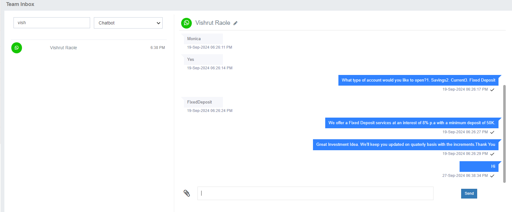

# Team Inbox

The **Team Inbox** provides a centralized platform to monitor and manage all customer interactions, whether handled by a human agent or a chatbot.  

As an **Admin**, you have full visibility into all chats and can easily take over any ongoing conversation from an agent or chatbot, ensuring a seamless customer experience.

Each agent has a **unique login**, which limits access to their assigned chats and safeguards sensitive customer information.

---

## Key Features

- **Centralized Monitoring:** View all customer interactions in one place.  
- **Admin Takeover:** Instantly step into any conversation for quick resolutions.  
- **Secure Access:** Unique logins ensure privacy and data protection.  
- **Search & Filter:** Quickly locate conversations by agent, chatbot, or custom criteria.  

---

