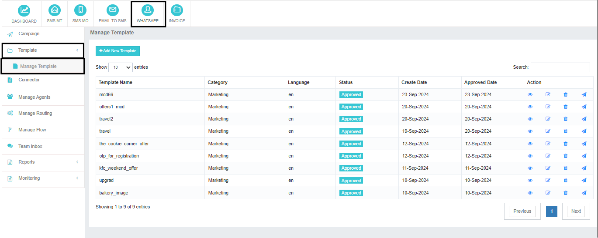
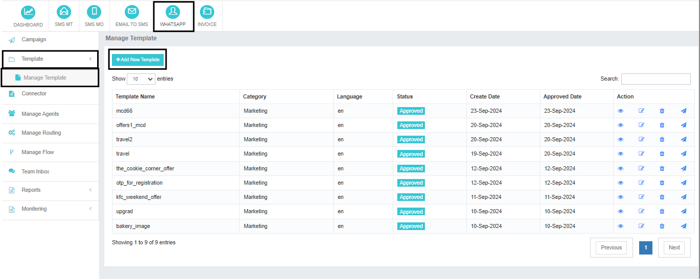
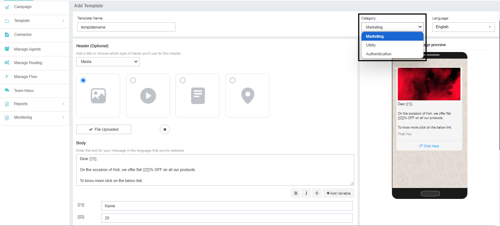
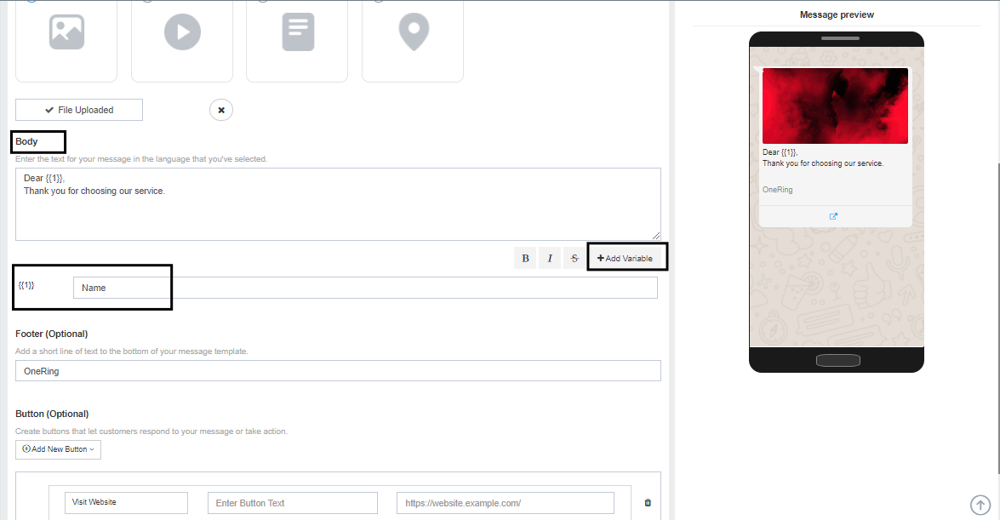
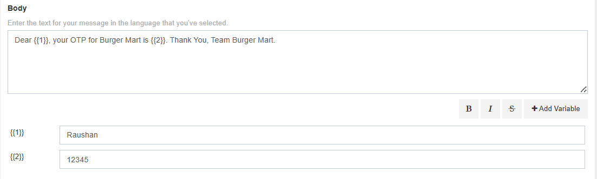
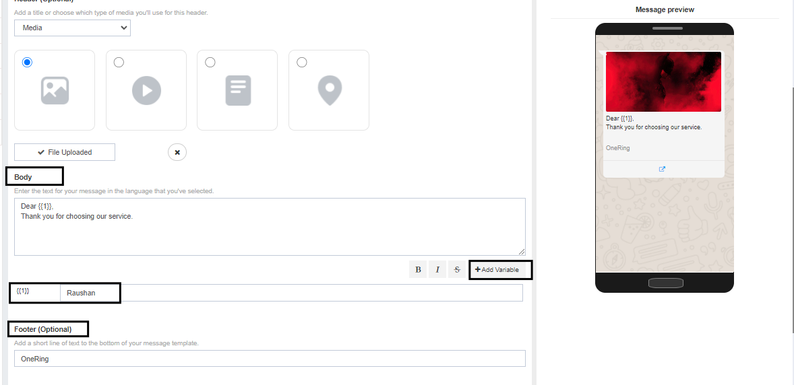
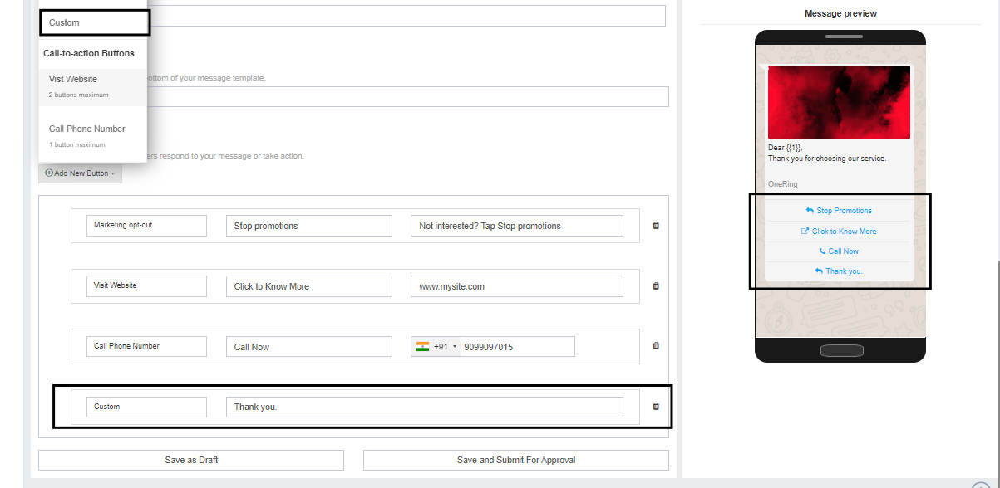
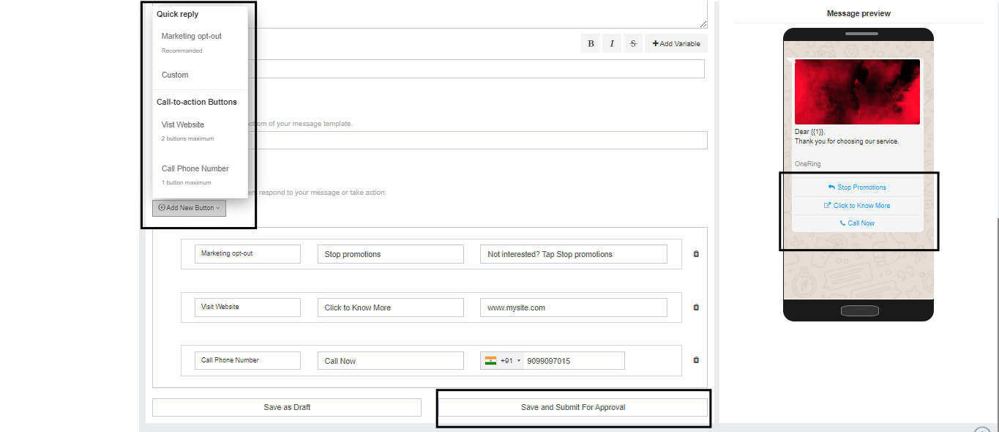
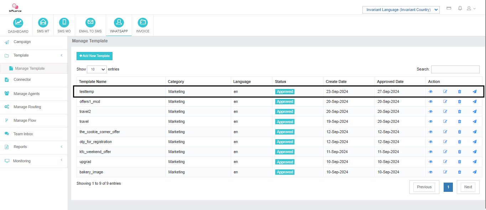
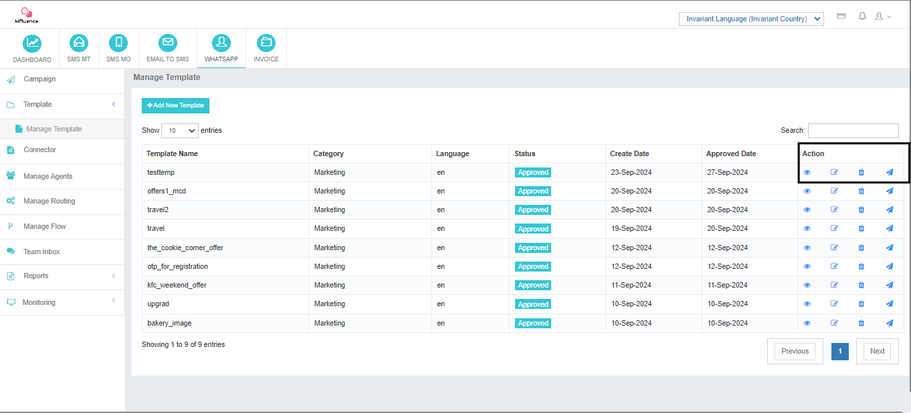

# Template

A WhatsApp Template is a pre-approved message format provided by Meta that businesses can use to send automated messages to their customers. These templates ensure compliance with WhatsApp's messaging policies and help businesses deliver consistent and effective communication.

## Why Use WhatsApp Templates?

- **Compliance:** Templates help businesses adhere to WhatsApp's strict messaging guidelines, preventing account restrictions.  
- **Efficiency:** Pre-approved templates streamline the messaging process, saving time and effort.  
- **Consistency:** Consistent messaging formats enhance brand identity and customer experience.  
- **Personalization:** Templates can be customized with dynamic variables to deliver personalized messages.  

---

## Submitting a New Template

To submit a new template:

- Navigate to `WhatsApp > Template > Manage Template > Add New Template`.

---

## Template Categories

Templates need to be approved under a specific category by Meta. There are three categories:

1. **Marketing:** Promotional messages sent to multiple recipients.  
2. **Utility:** Timely updates related to the purchase process or customer journey.  
3. **Authentication:** Templates used for one-time pass-codes and user verification.  

---

## Step-by-Step Guide to Adding a New Template

### 1. Select a Category
Choose the appropriate category (Marketing, Utility, or Authentication) based on the purpose of the message.

### 2. Select Language
Meta supports various languages. Select the language in which the content will be delivered.

### 3. Add a Header (Optional)
The header is the title or heading of the template. There are three options:  
- **None:** No header.  
- **Text:** Add a text heading.  
- **Media:** Insert an image, video, document, or location as the header.  

> **Note:** The header is optional and can be skipped if not needed.

---

### 4. Add Body Content
The body is the main message content that must be approved by Meta. Brands can add variables (placeholders) that will be replaced with actual values during the campaign.

To add a variable:
- Click the **Variable** button below the body text.  
- The variable will appear as `{{1}}`, indicating the first variable in the content.  
- Add additional variables as needed (`{{2}}`, `{{3}}`, etc.).

#### Example:

Here, `{{1}}` can be replaced by the customer's name during the campaign and `{{2}}` can be replaced with the OTP.

For the approval process, you need to add an example in the box provided below against each variable. This helps Meta understand the message content properly and approve the template.

---

### 5. Add a Footer (Optional)
Insert text or brand information as the footer if required. It's an optional parameter and can be left blank if not needed.

---

### 6. Add Buttons (Optional)
Buttons allow recipients to take action directly from the message. There are two types of buttons:

- **Opt-Out:**  
  Example: *"If you are not interested in this message, click 'Opt-Out' to avoid receiving such messages in the future."*  
  You can also create a custom response by clicking on **Custom Button**.

- **Call-to-Action (CTA) Buttons:**  
  - **Visit Website:** Redirect users to a website (up to two buttons allowed).  
  - **Call Phone Number:** Let users call a pre-configured number directly from the message.

---

## Saving and Submitting the Template

Once all information is added, you can either:  
- **Save as Draft:** Save the template for further editing.  
- **Save and Submit for Approval:** Submit the template to Meta for approval.  

Once the brand adds the template for approval, it usually takes a few seconds to get it approved. Once approved, the brand can use the template for initiating campaigns.

---

## Post-Approval Actions for WhatsApp Templates

Once your WhatsApp template is approved by Meta, you have several options to manage and utilize it:

1. **Preview:** View the approved template to ensure it meets your expectations.  
2. **Edit:** Modify the template content (subject to re-approval by Meta).  
3. **Delete:** Remove the template if it's no longer needed.  
4. **Initiate Campaign:** Directly launch a new campaign using the approved template. Simply import your target contact list and send your message.  

By effectively utilizing these post-approval actions, you can streamline your WhatsApp marketing efforts and deliver impactful campaigns.

