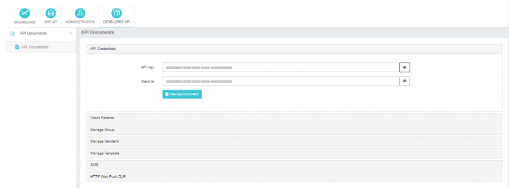
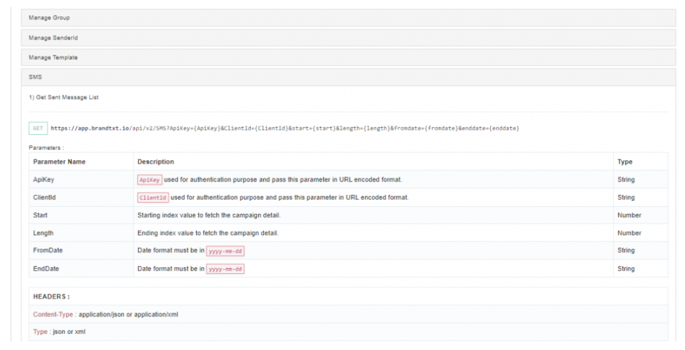
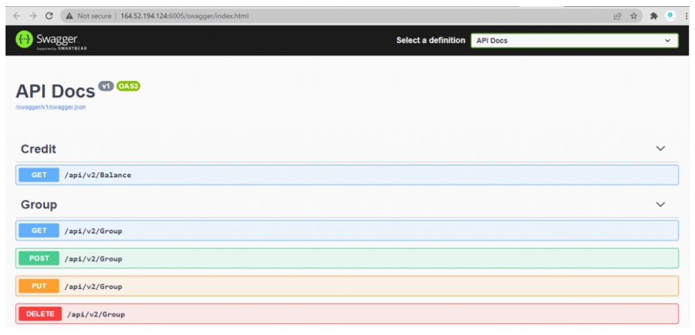

---

### Developer API: Empowering Integration with SMS API

The **Developer API** feature in iTextPro enables users to integrate various SMS APIs, allowing seamless submission of SMS messages to the application.  
This section provides access to a comprehensive **API Document**—a complete reference manual detailing request payloads, response types, and best practices for effective integration.

---

#### Key Features

- **SMS API Integration**  
  Utilize multiple SMS API endpoints to submit SMS to the iTextPro application.

- **Comprehensive API Document**  
  A clear, concise, and complete guide for developers, covering all integration details.

- **Reference Manual**  
  Includes detailed explanations of request payload formats, response structures, authentication, and error handling.

- **Swagger Tool Integration**  
  The **View API Document** option opens the Swagger tool—offering a secure, reliable, and interactive REST API testing interface for third-party integration.

---

#### Steps to Access Developer API & API Document

1. **Access Developer API**  
   Navigate to the **Developer API** section within the iTextPro platform.

2. **View API Document**  
   Click **View API Document** to open the complete API reference.

3. **Use Swagger Tool**  
   The system redirects you to the Swagger tool, where you can test, explore, and integrate SMS API functionalities.

---

The **Developer API** in iTextPro empowers developers to integrate SMS capabilities into their own applications with ease.  
The combination of a detailed API reference and Swagger’s interactive testing interface ensures efficient, secure, and reliable integration.
