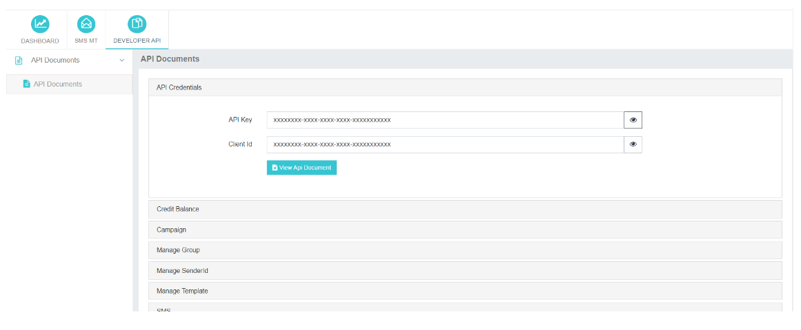

---

### API Documents: Access and Generate Request URLs

The **API Documents** feature in iTextPro enables users to seamlessly integrate various APIs, enhancing the platform’s functionality.  
Users can access comprehensive API documentation containing essential details such as request URLs, payload structures, and usage guidelines.

---

#### Key Features

- **API Integration Opportunities**  
  Explore multiple APIs to extend and customize iTextPro’s capabilities.

- **Comprehensive API Documentation**  
  Clear, concise, and complete guides with all the information required for smooth integration.

- **Request URL Generation**  
  Use the **View API Document** option to generate and review different request URLs used within iTextPro.

---

#### Steps to Access API Documents & Request URLs

1. **Access API Documents**  
   Navigate to the **API Documents** section within the iTextPro platform.

2. **View API Document**  
   Click **View API Document** to open the detailed API reference.

3. **Generate Request URLs**  
   Inside the document, generate and retrieve various request URLs for use in integration.

---

The **API Documents & Request URLs** feature equips users with the information and tools necessary for effective API integration.  
From exploring diverse API options to generating request URLs, this functionality supports a seamless and efficient integration experience.
