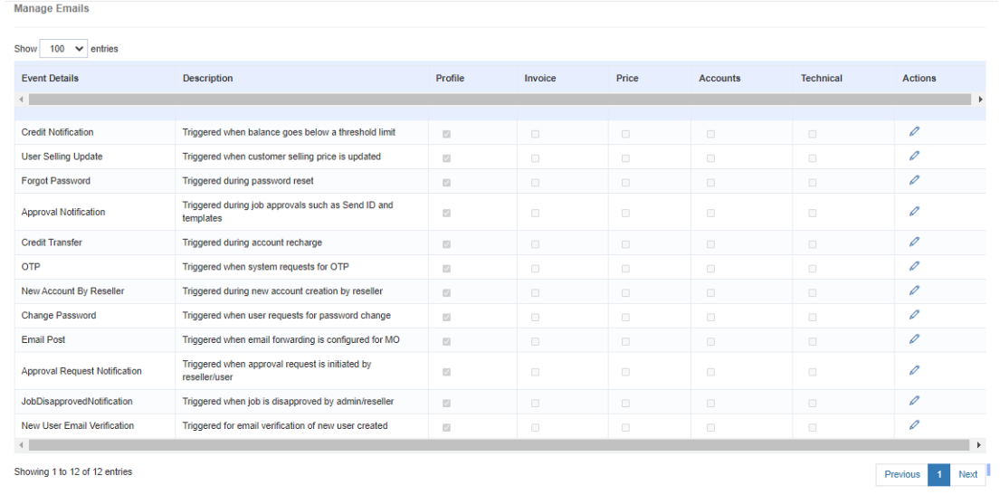

## Notification Emails: Stay Informed with Email Alerts

The **Notification Emails** feature in iTextPro empowers users to enable **email notification alerts** for various events within the application. This ensures that stakeholders — including those configured in the user profile — receive timely updates.

---

### Key Features

- **Email Notification Alerts**  
  Stay updated about important events and activities in iTextPro.

- **Stakeholder Email IDs**  
  Send notifications to specific stakeholders configured in the **user profile**.

- **Default Email**  
  All notifications are sent by default to the user's **registered email address**.

---

### Steps to Enable Notification Emails

1. **Access Notification Emails**  
   Navigate to the **Notification Emails** section within iTextPro.

2. **Configure Email Alerts**  
   Enable alerts for selected stakeholders and set the relevant email addresses.

3. **Save Configuration**  
   Confirm and save your notification settings.

---

The **Notification Emails** feature ensures **timely, targeted communication**, keeping both users and stakeholders informed about key updates in the platform.
