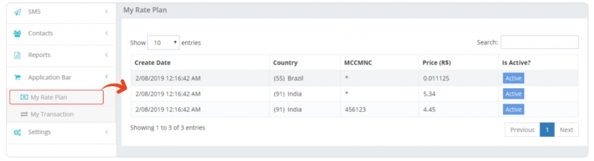

## My Rate Plan: Overview of Cost Prices

The **My Rate Plan** option in iTextPro gives users a clear overview of their **cost prices** as defined by their **parent account**.  
It displays detailed pricing information by **country** and **network**.

---

### Key Features

- **Visibility of Cost Prices**  
  View the cost prices linked to your account, as provided by the parent account.

- **Detailed Information**  
  Access country-wise and network-wise breakdown of cost prices for better transparency.

---

### Steps to Access My Rate Plan

1. **Access My Rate Plan**  
   Navigate to the **My Rate Plan** section in iTextPro.

2. **View Cost Prices**  
   Review the details, including **country**, **network**, and **associated cost prices**.
