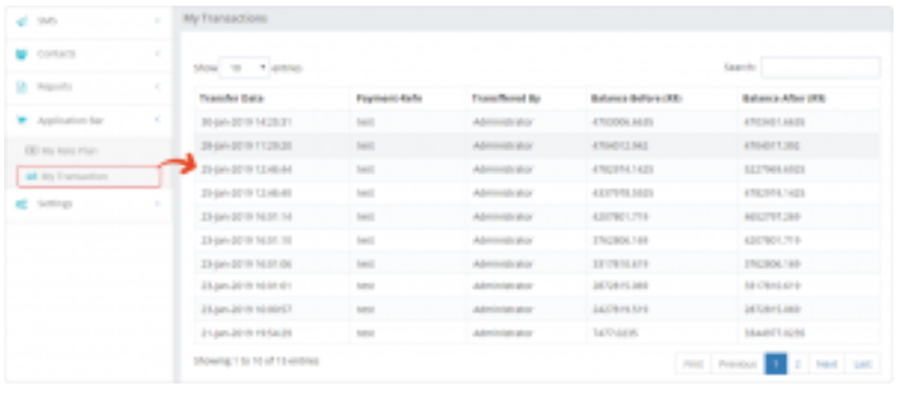

## My Transaction: Record of SMS Transactions

The **My Transaction** tab in iTextPro provides a complete record of all **SMS transactions** carried out by the **parent account** to the **user account**.  
It ensures transparency and allows users to track their SMS-related activities with ease.

---

### Key Features

- **Comprehensive Transaction History**  
  Maintains a detailed log of all SMS transactions from the parent account to the user account.

- **Transparency in Activities**  
  Ensures that all message transactions are visible for audit and review.

---

### Steps to View My Transactions

1. **Access My Transaction**  
   Navigate to the **My Transaction** tab within the iTextPro platform.

2. **Review Transaction Records**  
   Browse through the detailed history of all SMS transactions sent from your parent account.
