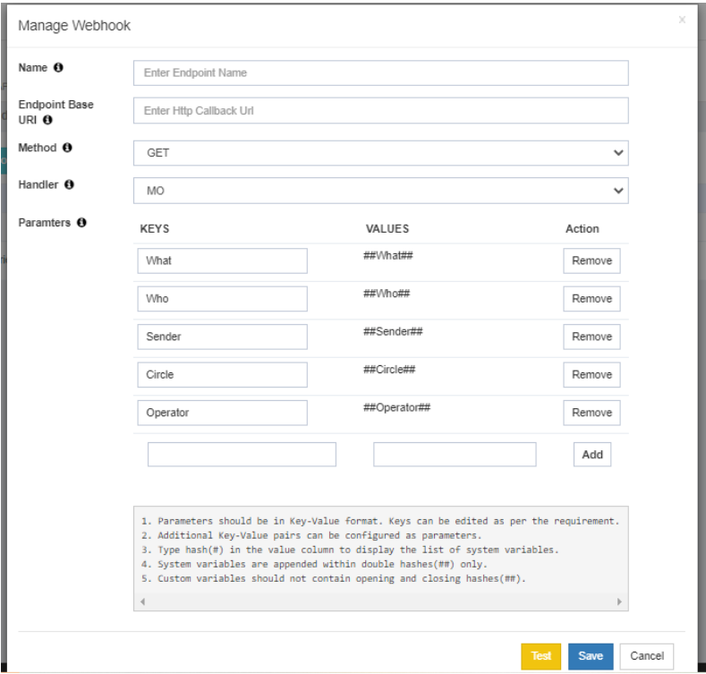

## Webhooks: Real-time DLR/MO Notifications

The **Webhooks** feature in iTextPro enables users to receive **real-time notifications** of **DLR (Delivery Receipt)** and **MO (Mobile Originated)** messages through HTTP Web push.

---

### Key Features

- **Real-time Notifications**  
  Instantly receive copies of DLR/MO messages as they occur.

- **DLR/MO Handling**  
  Choose the handler type — whether the webhook is intended for **MO** or **DLR**.

- **Flexible Configuration**  
  Set a friendly name, define the endpoint base URL, select the request method (**GET** or **POST**), and assign the appropriate handler.

- **Timeout Awareness**  
  Webhook requests have a **default timeout of 10 seconds**. The configured endpoint should return a **200 OK** response within this time.

---

### Steps to Configure Webhooks

1. **Access Webhooks**  
   Navigate to the **Webhooks** section in iTextPro.

2. **Add New Webhook**  
   Click **"Add New Webhook"** to create a new configuration.

3. **Specify Details**  
   - Friendly Name  
   - Endpoint Base URL  
   - Method (**GET** or **POST**)  
   - Handler (**MO** or **DLR**)

4. **Save Configuration**  
   Confirm and save the webhook details.

---

The **Webhooks** feature ensures **instant, reliable, and configurable message updates**, helping users maintain efficient communication flow with real-time data delivery.
