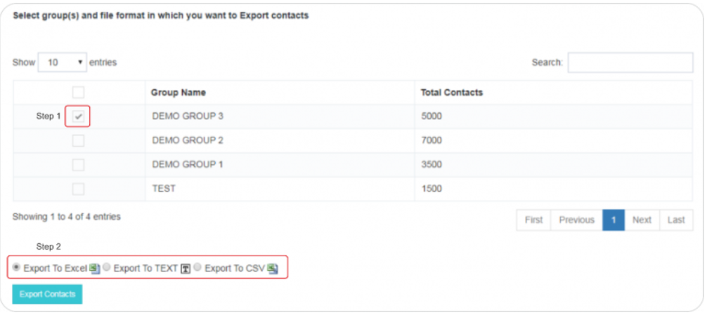

# Export Contacts

The **Export Contacts** feature in iTextPro provides users with a convenient way to retrieve contacts from specific groups and export them in various file formats (`.xls` / `.csv` / `.txt`).  
This section outlines the simple process for exporting contacts.

---

## Steps to Export Contacts

1. **Select Group**  
   Choose the specific group from which you want to export contacts by clicking on the checkbox next to the group name.

2. **Initiate Export**  
   Once the desired group is selected, click on the **Export** option to initiate the export process.

3. **Choose File Format**  
   Select the preferred file format for the exported contacts:  
   - `.xls`  
   - `.csv`  
   - `.txt`  

4. **Confirm and Download**  
   Confirm the export selection and proceed to download the exported contacts file.

---

## Usage Guidelines

- **Selective Export** – Export only the groups you need to keep exported lists manageable.  
- **Multiple Formats** – Choose the file format that best suits your data processing requirements.  
- **Backup Purpose** – Use this feature to create backups of important contact lists.  
