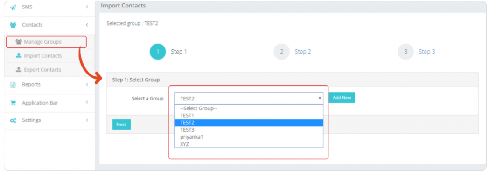
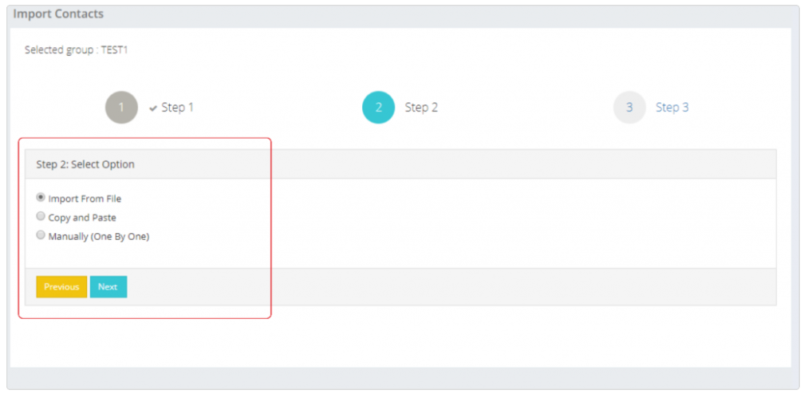
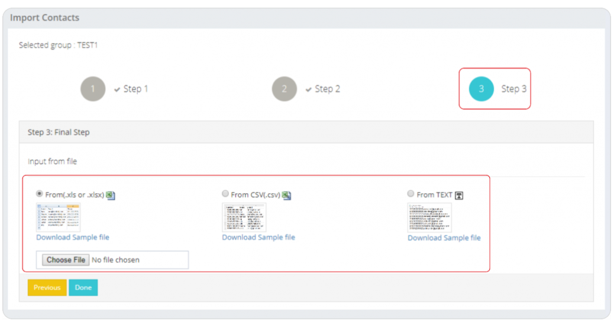

# Import Contacts: Streamlined Contact Addition to Groups

The **Import Contacts** feature in iTextPro facilitates a straightforward process for users to add contacts to groups efficiently. This section outlines the simple three-step process for importing contacts, providing users with multiple options for streamlined contact management.

---

## Three Methods for Importing Contacts

### 1. Import From a File
Bulk import contacts from a file (`.xls` / `.csv` / `.txt`).  
This method is suitable for adding a large number of contacts simultaneously.

### 2. Copy and Paste
Copy and paste contacts directly from an Excel sheet.  
This method offers a quick and flexible way to input contacts.

### 3. Manual Entry
Add contacts one by one manually.  
This method is suitable for situations where a small number of contacts need to be added.

---

## Steps to Import Contacts

1. **Select Group**  
   Choose the specific group to which you want to add contacts from the dropdown menu.

2. **Select Import Method**  
   Choose the preferred method for importing contacts:  
   - **Import From a File** – Bulk import from a file.  
   - **Copy and Paste** – Directly copy and paste contacts from Excel.  
   - **Manual Entry** – Add contacts one by one.

3. **Confirm and Complete**  
   Confirm the addition of contacts by clicking on the **Done** button.

---

## Usage Guidelines

- **Efficient Group Management** – Use the Import Contacts feature to efficiently manage contacts within specific groups.  
- **Bulk Import** – For large datasets, opt for the **Import From a File** method for bulk contact import.  
- **Quick Copy and Paste** – Use this method for rapid addition of contacts from Excel.  
- **Manual Entry** – Ideal for adding a few contacts individually.  

> **Note:** Ensure that the file format (`.xls`, `.csv`, `.txt`) is compatible when using the **Import From a File** method.
