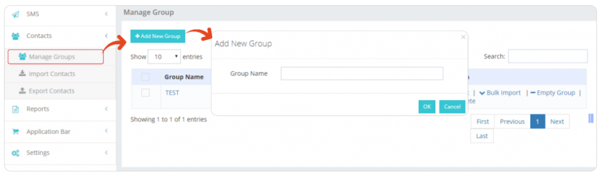
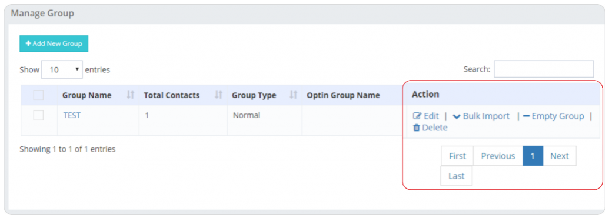

# Contacts

This section consists of the following options:
- **Manage Group**
- **Import Group**
- **Export Group**

---

## Group Settings Management
Users can access a range of group settings, including the ability to:
- Edit group names
- Bulk import contacts
- Empty groups
- Delete groups

---

## Group Settings Options

### Edit Group Name
Users have the option to edit the name of a specific group, ensuring relevance and clarity in contact organization.

### Bulk Import Contacts
The bulk import feature allows users to add multiple contacts to a group simultaneously, streamlining the process of populating contact groups.

### Empty Group
Users can choose to empty a group, removing all contacts from that particular group while retaining the group structure for future use.

### Delete Group
The delete group option provides users with the ability to remove an entire contact group when it is no longer needed.

---

## Steps to Manage Group Settings

1. **Access Manage Group**  
   Navigate to the **Manage Group** section within the iTextPro platform.

2. **Select Group**  
   Choose the specific group for which you want to manage settings.

3. **Choose Group Action**  
   Depending on your requirements, select the appropriate group action:  
   - **Edit Group Name** – Modify the name of the selected group.  
   - **Bulk Import Contacts** – Add multiple contacts to the selected group.  
   - **Empty Group** – Remove all contacts from the group.  
   - **Delete Group** – Permanently delete the entire group.

4. **Save Changes**  
   Confirm and save any changes made to the group settings.

