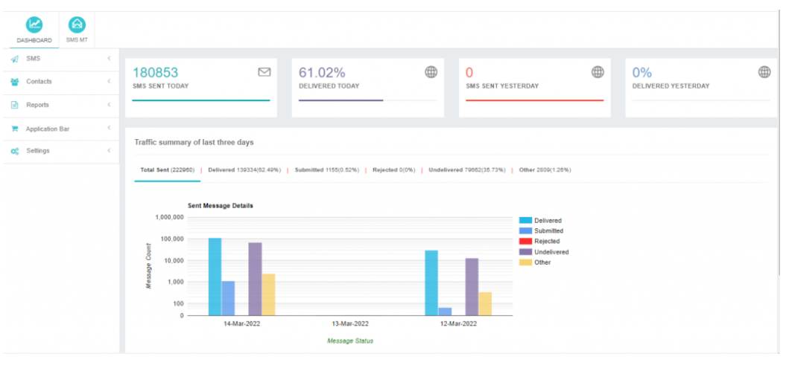

# iText Hub User Panel

## User Module: Empowering End-Users
The User Module in iTextPro is designed to empower end-users with a comprehensive set of functionalities, allowing them to efficiently manage their SMS campaigns, contacts, traffic, reports, profile, and settings.

### Key Features:
- **New Campaign Trigger:** Initiate a new SMS campaign seamlessly.
- **Contact Management:** Effectively manage and organize contacts for targeted communication.
- **Traffic Viewing:** View both Mobile Originated (MO) and Mobile Terminated (MT) traffic for enhanced monitoring.
- **Report Download:** Download detailed reports for in-depth analysis and insights.
- **Profile Management:** Easily manage and update user profiles.
- **Settings Management:** Configure and manage various settings to customize the user experience.

## Dashboard: Proactive Monitoring and Insights

Upon logging in to the user account, users are greeted with the User Dashboard, providing valuable insights into SMS traffic patterns and campaign performance.

### Insights Available on the User Dashboard:
- **SMS Sent Today:** Displays the total number of SMS messages sent by the user from different interfaces on the current day.
- **Delivered Today:** Highlights the total number of SMS messages successfully delivered to the destination numbers on the current day.
- **SMS Sent Yesterday:** Presents the total count of SMS messages sent by the user on the previous day.
- **Delivered Yesterday:** Showcases the total number of SMS messages delivered to the destination numbers on the previous day.