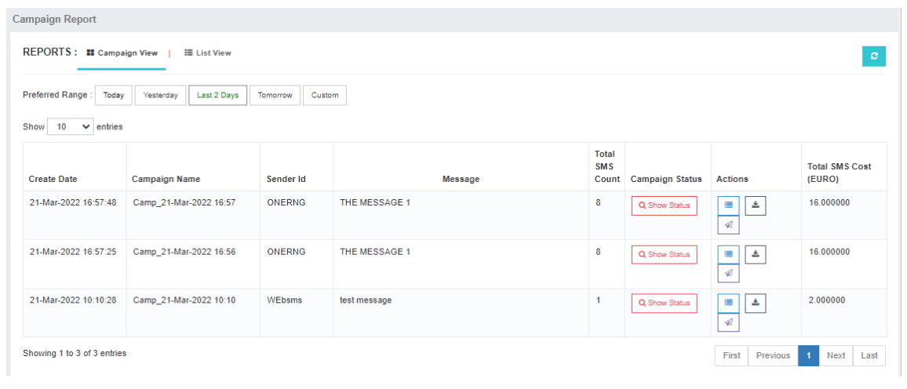
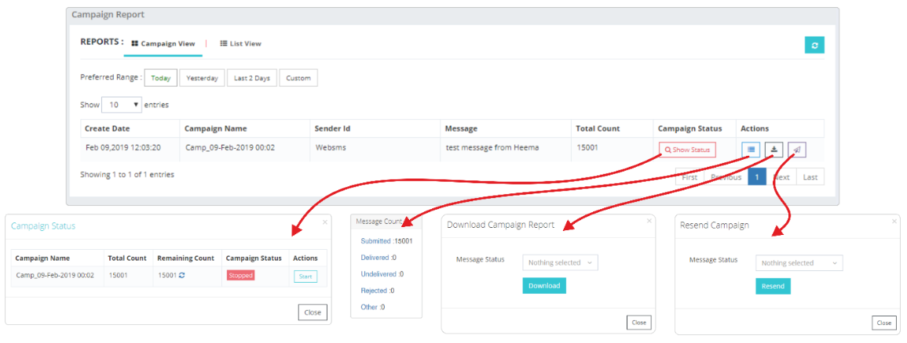

# Reports: Comprehensive Analysis of MT Messages

The **Reports** tab in iTextPro provides users with a comprehensive set of tools to analyze and track **MT (Mobile Terminated)** messages.  
It includes features like **Campaign Reports**, **Schedule Campaigns**, **Message Counts**, and **Download Reports**.

---

## Campaign Reports

### Campaign View
Displays a consolidated list of campaigns executed by the user.  
Users can quickly access key campaign details, including:
- Campaign status
- Delivery rates
- Execution dates
- Other relevant statistics

---

### List View
Presents a consolidated **DLR (Delivery Receipt)** report for executed campaigns.  
Users can review detailed delivery status information for each message within a campaign.

---

### Campaign Status
- Navigate to **Show Campaign Status** to view the message queue and track campaign progress.  
- Provides a real-time view of completed and pending deliveries.

---

### Stopping a Campaign
If needed, campaigns can be halted mid-process:
1. Go to the desired campaign.
2. Click the **Stop** button.

---

### Actions Tab
Offers message status counts for executed campaigns, helping users analyze:
- Delivered messages
- Pending messages
- Failed messages
- Other status categories

---

### Download Report
Enables downloading the complete campaign report in **Excel (.xls)** format for:
- Offline review
- Archival purposes
- Advanced data analysis

---

### Resend Tab
Allows resending campaign messages based on their status (e.g., failed or pending).

**Resend Eligibility:**

- ✅ Available for **executed campaigns**  
- ❌ Not available for **queued campaigns** or **long messages still in progress**

---

**Tip:** Use the **Download Report** option before resending to validate the target list and avoid duplicate deliveries.
