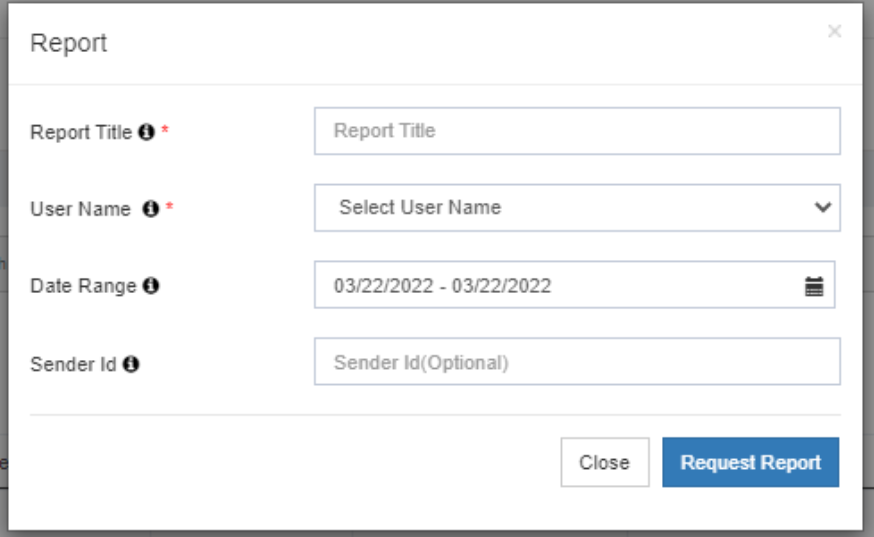
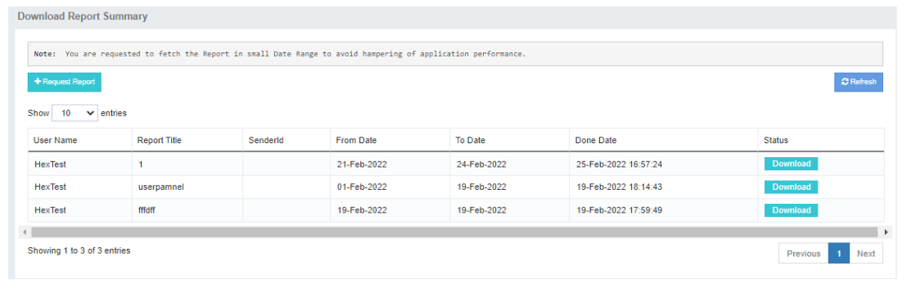

## Download Report: Accessing and Requesting Reports

The **Download Report** tab in iTextPro acts as a central hub for managing reports.  
It allows users to **access previously requested reports** and **initiate new report requests**.

---

### Key Features

- **Visibility of Requested Reports**  
  All previously requested reports are listed under the **Download Report** tab for quick access.

- **Request New Reports**  
  Use the **Request Report** option to generate new reports as needed.

- **Pending Status Indication**  
  Reports marked as *Pending* mean that the system is still fetching the required data.  
  These will be available for download once processing is complete.

---

### Steps to Access and Request Reports

1. **Access Download Report**  
   Navigate to the **Download Report** tab in iTextPro.

2. **View Requested Reports**  
   Browse the list of previously requested reports.  
   Click on the desired report to download it.

3. **Request a New Report**  
   Use the **Request Report** button to initiate a new report request.

4. **Monitor Pending Status**  
   If the report is marked as *Pending*, wait until it is processed and becomes available for download.

---

